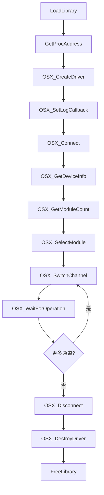
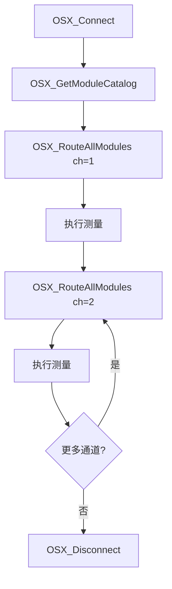

# UDL.SantecOSX 驱动接口文档

## 概述

| 属性 | 值 |
|---|---|
| DLL 名称 | `UDL.SantecOSX.dll` |
| 用途 | Santec OSX-100 系列光开关驱动 |
| 目标设备 | Santec OSX-100 光开关 |
| 通信方式 | TCP/IP（默认）、USB (VISA) |
| 默认端口 | 5025 |
| 函数前缀 | `OSX_` |
| 调用约定 | `__stdcall` (WINAPI) |
| 加载方式 | `LoadLibrary` + `GetProcAddress` 动态加载 |

OSX 驱动用于控制 Santec OSX-100 系列光开关，支持多模块管理、1xN 通道切换、多模块同步路由。OSX-100 支持多种配置类型（1A/2A/2B/2C），每个配置对应不同的输入-输出切换方式。

---

## 数据结构

### CDeviceInfo

设备识别信息（从 `*IDN?` 解析）。

```c
struct CDeviceInfo
{
    char manufacturer[64];    // 制造商
    char model[64];           // 型号
    char serialNumber[64];    // 序列号
    char firmwareVersion[64]; // 固件版本
};
```

### CModuleInfo

模块信息（从 `MODule:CATalog?` 和 `MODule#:INFO?` 解析）。

```c
struct CModuleInfo
{
    int  index;               // 模块索引（从 0 开始）
    char catalogEntry[128];   // 模块目录描述（如 "SX 1Ax24"）
    char detailedInfo[256];   // 模块详细信息
    int  configType;          // 开关配置类型 (0=1A, 1=2A, 2=2B, 3=2C)
    int  channelCount;        // 通道数量
    int  currentChannel;      // 当前通道
    int  currentCommon;       // 当前公共输入端（用于 2A/2C 配置）
};
```

### CConnectionConfig

连接配置。

```c
struct CConnectionConfig
{
    char   ipAddress[64];     // IP 地址
    int    port;              // TCP 端口
    double timeout;           // 超时（秒）
    int    bufferSize;        // 缓冲区大小
    int    reconnectAttempts; // 重连尝试次数
    double reconnectDelay;    // 重连延迟（秒）
};
```

---

## 枚举类型

### 开关配置类型 (SwitchConfigType)

| 值 | 名称 | 说明 |
|---|---|---|
| 0 | CONFIG_1A | 单输入，可切换到任意输出 |
| 1 | CONFIG_2A | 两个可切换输入，可切换到任意输出 |
| 2 | CONFIG_2B | 两个输入切换到同步输出 |
| 3 | CONFIG_2C | 两个输入，第二个跟随第一个 |

### 连接状态 (ConnectionState)

| 值 | 名称 | 说明 |
|---|---|---|
| 0 | STATE_DISCONNECTED | 已断开 |
| 1 | STATE_CONNECTING | 正在连接 |
| 2 | STATE_CONNECTED | 已连接 |
| 3 | STATE_ERROR | 连接错误 |

### 通信类型 (CommType)

| 值 | 名称 | 说明 |
|---|---|---|
| 0 | COMM_TCP | TCP/IP 连接 |
| 1 | COMM_GPIB | GPIB 连接 |
| 2 | COMM_USB | USB (VISA) 连接 |
| 3 | COMM_DLL | DLL 内部连接 |

### 日志级别 (LogLevel)

| 值 | 名称 | 说明 |
|---|---|---|
| 0 | LOG_DEBUG | 调试信息 |
| 1 | LOG_INFO | 一般信息 |
| 2 | LOG_WARNING | 警告 |
| 3 | LOG_ERROR | 错误 |

---

## API 函数列表

### 1. 驱动生命周期

#### OSX_CreateDriver

创建 OSX 驱动实例（TCP 模式）。

```c
HANDLE WINAPI OSX_CreateDriver(const char* ip, int port);
```

| 参数 | 类型 | 说明 |
|---|---|---|
| ip | `const char*` | 设备 IP 地址 |
| port | `int` | TCP 端口，`0` 表示使用默认端口 5025 |

**返回值**: `HANDLE` -- 成功返回驱动句柄，失败返回 `NULL`。

#### OSX_CreateDriverEx

创建驱动实例（扩展版本，支持 USB/VISA）。

```c
HANDLE WINAPI OSX_CreateDriverEx(const char* address, int port, int commType);
```

| 参数 | 类型 | 说明 |
|---|---|---|
| address | `const char*` | TCP 模式为 IP 地址，USB 模式为 VISA 资源字符串 |
| port | `int` | TCP 端口（USB 模式忽略） |
| commType | `int` | 通信类型：0=TCP, 2=USB(VISA) |

**返回值**: `HANDLE` -- 成功返回驱动句柄，失败返回 `NULL`。

#### OSX_DestroyDriver

销毁驱动实例并释放资源。

```c
void WINAPI OSX_DestroyDriver(HANDLE hDriver);
```

---

### 2. 连接管理

#### OSX_Connect

连接到设备。

```c
BOOL WINAPI OSX_Connect(HANDLE hDriver);
```

**返回值**: `TRUE` 成功，`FALSE` 失败。

#### OSX_Disconnect

断开连接。

```c
void WINAPI OSX_Disconnect(HANDLE hDriver);
```

#### OSX_Reconnect

重新连接（先断开再连接）。

```c
BOOL WINAPI OSX_Reconnect(HANDLE hDriver);
```

**返回值**: `TRUE` 成功，`FALSE` 失败。

#### OSX_IsConnected

检查是否已连接。

```c
BOOL WINAPI OSX_IsConnected(HANDLE hDriver);
```

---

### 3. 设备信息

#### OSX_GetDeviceInfo

获取设备识别信息。

```c
BOOL WINAPI OSX_GetDeviceInfo(HANDLE hDriver, CDeviceInfo* info);
```

**返回值**: `TRUE` 成功，`FALSE` 失败。

#### OSX_CheckError

查询设备最近的错误。

```c
int WINAPI OSX_CheckError(HANDLE hDriver, char* message, int messageSize);
```

**返回值**: 错误代码（0 = 无错误）。

#### OSX_GetSystemVersion

获取系统版本号。

```c
BOOL WINAPI OSX_GetSystemVersion(HANDLE hDriver, char* version, int versionSize);
```

| 参数 | 类型 | 说明 |
|---|---|---|
| version | `char*` | 接收版本字符串的缓冲区 |
| versionSize | `int` | 缓冲区大小 |

**返回值**: `TRUE` 成功，`FALSE` 失败。

---

### 4. 模块管理

#### OSX_GetModuleCount

获取已安装模块数量。

```c
int WINAPI OSX_GetModuleCount(HANDLE hDriver);
```

**返回值**: 模块数量。

#### OSX_GetModuleCatalog

获取所有模块的目录信息。

```c
int WINAPI OSX_GetModuleCatalog(HANDLE hDriver, CModuleInfo* modules, int maxCount);
```

| 参数 | 类型 | 说明 |
|---|---|---|
| modules | `CModuleInfo*` | 预分配的模块信息数组 |
| maxCount | `int` | 数组最大容量 |

**返回值**: 实际写入的模块数量。

#### OSX_GetModuleInfo

获取指定模块的详细信息。

```c
BOOL WINAPI OSX_GetModuleInfo(HANDLE hDriver, int moduleIndex, CModuleInfo* info);
```

| 参数 | 类型 | 说明 |
|---|---|---|
| moduleIndex | `int` | 模块索引（从 0 开始） |

**返回值**: `TRUE` 成功，`FALSE` 失败。

#### OSX_SelectModule

选择当前活动模块。

```c
BOOL WINAPI OSX_SelectModule(HANDLE hDriver, int moduleIndex);
```

**返回值**: `TRUE` 成功，`FALSE` 失败。

#### OSX_SelectNextModule

选择下一个模块（循环）。

```c
BOOL WINAPI OSX_SelectNextModule(HANDLE hDriver);
```

**返回值**: `TRUE` 成功，`FALSE` 失败。

#### OSX_GetSelectedModule

获取当前选中的模块索引。

```c
int WINAPI OSX_GetSelectedModule(HANDLE hDriver);
```

**返回值**: 当前选中模块索引（从 0 开始）。

---

### 5. 通道切换

这些函数操作**当前选中模块**的通道。

#### OSX_SwitchChannel

切换当前模块到指定通道。

```c
BOOL WINAPI OSX_SwitchChannel(HANDLE hDriver, int channel);
```

| 参数 | 类型 | 说明 |
|---|---|---|
| channel | `int` | 目标通道号（从 1 开始） |

**返回值**: `TRUE` 成功，`FALSE` 失败。

#### OSX_SwitchNext

切换到下一个通道（循环）。

```c
BOOL WINAPI OSX_SwitchNext(HANDLE hDriver);
```

#### OSX_GetCurrentChannel

获取当前模块的当前通道号。

```c
int WINAPI OSX_GetCurrentChannel(HANDLE hDriver);
```

**返回值**: 当前通道号。

#### OSX_GetChannelCount

获取当前模块的通道总数。

```c
int WINAPI OSX_GetChannelCount(HANDLE hDriver);
```

**返回值**: 通道总数。

---

### 6. 多模块路由

直接操作指定模块的通道，无需先 `SelectModule`。

#### OSX_RouteChannel

路由指定模块到指定通道。

```c
BOOL WINAPI OSX_RouteChannel(HANDLE hDriver, int moduleIndex, int channel);
```

| 参数 | 类型 | 说明 |
|---|---|---|
| moduleIndex | `int` | 模块索引（从 0 开始） |
| channel | `int` | 目标通道号 |

**返回值**: `TRUE` 成功，`FALSE` 失败。

#### OSX_GetRouteChannel

查询指定模块当前路由通道。

```c
int WINAPI OSX_GetRouteChannel(HANDLE hDriver, int moduleIndex);
```

**返回值**: 当前路由通道号。

#### OSX_RouteAllModules

将所有模块路由到同一个通道。

```c
BOOL WINAPI OSX_RouteAllModules(HANDLE hDriver, int channel);
```

| 参数 | 类型 | 说明 |
|---|---|---|
| channel | `int` | 目标通道号 |

**返回值**: `TRUE` 成功，`FALSE` 失败。

#### OSX_SetCommonInput

设置指定模块的公共输入端（用于 2A/2C 配置）。

```c
BOOL WINAPI OSX_SetCommonInput(HANDLE hDriver, int moduleIndex, int common);
```

| 参数 | 类型 | 说明 |
|---|---|---|
| moduleIndex | `int` | 模块索引 |
| common | `int` | 公共输入端编号 |

#### OSX_GetCommonInput

查询指定模块的公共输入端。

```c
int WINAPI OSX_GetCommonInput(HANDLE hDriver, int moduleIndex);
```

#### OSX_HomeModule

将指定模块复位到初始通道。

```c
BOOL WINAPI OSX_HomeModule(HANDLE hDriver, int moduleIndex);
```

---

### 7. 控制

#### OSX_SetLocalMode

设置本地/远程模式。

```c
BOOL WINAPI OSX_SetLocalMode(HANDLE hDriver, BOOL local);
```

| 参数 | 类型 | 说明 |
|---|---|---|
| local | `BOOL` | `TRUE`=本地模式（面板可操作）, `FALSE`=远程模式 |

#### OSX_GetLocalMode

查询当前模式。

```c
BOOL WINAPI OSX_GetLocalMode(HANDLE hDriver);
```

**返回值**: `TRUE`=本地模式, `FALSE`=远程模式。

#### OSX_SendNotification

在设备屏幕上显示通知消息。

```c
BOOL WINAPI OSX_SendNotification(HANDLE hDriver, int icon, const char* message);
```

| 参数 | 类型 | 说明 |
|---|---|---|
| icon | `int` | 图标编号 |
| message | `const char*` | 通知内容 |

#### OSX_Reset

重置设备。

```c
BOOL WINAPI OSX_Reset(HANDLE hDriver);
```

---

### 8. 网络信息

#### OSX_GetNetworkInfo

获取设备网络配置。

```c
BOOL WINAPI OSX_GetNetworkInfo(HANDLE hDriver, char* ip, char* gateway,
                                char* netmask, char* hostname, char* mac,
                                int bufSize);
```

| 参数 | 类型 | 说明 |
|---|---|---|
| ip | `char*` | 接收 IP 地址 |
| gateway | `char*` | 接收网关地址 |
| netmask | `char*` | 接收子网掩码 |
| hostname | `char*` | 接收主机名 |
| mac | `char*` | 接收 MAC 地址 |
| bufSize | `int` | 每个缓冲区大小 |

---

### 9. 操作同步

#### OSX_WaitForOperation

等待当前操作完成。

```c
BOOL WINAPI OSX_WaitForOperation(HANDLE hDriver, int timeoutMs);
```

| 参数 | 类型 | 说明 |
|---|---|---|
| timeoutMs | `int` | 超时时间（毫秒） |

**返回值**: `TRUE` 操作完成，`FALSE` 超时。

---

### 10. 原始 SCPI 命令

#### OSX_SendCommand

发送原始 SCPI 命令并接收响应。

```c
BOOL WINAPI OSX_SendCommand(HANDLE hDriver, const char* command,
                             char* response, int responseSize);
```

---

### 11. 日志

#### OSX_SetLogCallback

设置日志回调函数。

```c
typedef void (WINAPI *OSXLogCallback)(int level, const char* source, const char* message);

void WINAPI OSX_SetLogCallback(OSXLogCallback callback);
```

---

### 12. VISA 枚举

#### OSX_EnumerateVisaResources

枚举可用的 VISA 资源（USB 设备）。

```c
int WINAPI OSX_EnumerateVisaResources(char* buffer, int bufferSize);
```

**返回值**: 找到的资源数量。`buffer` 中以分号分隔各资源字符串。

---

## 调用流程

### 单模块操作



### 多模块同步路由



---

## 调用 Demo

```cpp
#include <Windows.h>
#include <cstdio>

// ---- 数据结构（与 DLL 导出对齐）----

struct CDeviceInfo
{
    char manufacturer[64];
    char model[64];
    char serialNumber[64];
    char firmwareVersion[64];
};

struct CModuleInfo
{
    int  index;
    char catalogEntry[128];
    char detailedInfo[256];
    int  configType;
    int  channelCount;
    int  currentChannel;
    int  currentCommon;
};

// ---- 函数指针类型 ----

typedef HANDLE (WINAPI *PFN_OSX_CreateDriver)(const char*, int);
typedef void   (WINAPI *PFN_OSX_DestroyDriver)(HANDLE);
typedef BOOL   (WINAPI *PFN_OSX_Connect)(HANDLE);
typedef void   (WINAPI *PFN_OSX_Disconnect)(HANDLE);
typedef BOOL   (WINAPI *PFN_OSX_Reconnect)(HANDLE);
typedef BOOL   (WINAPI *PFN_OSX_IsConnected)(HANDLE);
typedef BOOL   (WINAPI *PFN_OSX_GetDeviceInfo)(HANDLE, CDeviceInfo*);
typedef int    (WINAPI *PFN_OSX_GetModuleCount)(HANDLE);
typedef int    (WINAPI *PFN_OSX_GetModuleCatalog)(HANDLE, CModuleInfo*, int);
typedef BOOL   (WINAPI *PFN_OSX_GetModuleInfo)(HANDLE, int, CModuleInfo*);
typedef BOOL   (WINAPI *PFN_OSX_SelectModule)(HANDLE, int);
typedef BOOL   (WINAPI *PFN_OSX_SwitchChannel)(HANDLE, int);
typedef BOOL   (WINAPI *PFN_OSX_SwitchNext)(HANDLE);
typedef int    (WINAPI *PFN_OSX_GetCurrentChannel)(HANDLE);
typedef int    (WINAPI *PFN_OSX_GetChannelCount)(HANDLE);
typedef BOOL   (WINAPI *PFN_OSX_RouteChannel)(HANDLE, int, int);
typedef int    (WINAPI *PFN_OSX_GetRouteChannel)(HANDLE, int);
typedef BOOL   (WINAPI *PFN_OSX_RouteAllModules)(HANDLE, int);
typedef BOOL   (WINAPI *PFN_OSX_WaitForOperation)(HANDLE, int);
typedef void   (WINAPI *PFN_OSXLogCallback)(int, const char*, const char*);
typedef void   (WINAPI *PFN_OSX_SetLogCallback)(PFN_OSXLogCallback);

// ---- 日志回调 ----

void WINAPI MyOSXLog(int level, const char* source, const char* message)
{
    static const char* levels[] = { "DEBUG", "INFO", "WARN", "ERROR" };
    printf("[OSX][%s] %s\n", (level >= 0 && level <= 3) ? levels[level] : "???", message);
}

// ---- 宏简化 GetProcAddress ----

#define LOAD_PROC(dll, type, name) \
    auto name = (type)GetProcAddress(dll, #name); \
    if (!name) { printf("未找到导出: %s\n", #name); FreeLibrary(dll); return 1; }

// ---- 主程序 ----

int main()
{
    // 1. 加载 DLL
    HMODULE hDll = LoadLibraryA("UDL.SantecOSX.dll");
    if (!hDll) { printf("无法加载 DLL\n"); return 1; }

    // 2. 解析函数地址
    LOAD_PROC(hDll, PFN_OSX_CreateDriver,     OSX_CreateDriver);
    LOAD_PROC(hDll, PFN_OSX_DestroyDriver,    OSX_DestroyDriver);
    LOAD_PROC(hDll, PFN_OSX_Connect,          OSX_Connect);
    LOAD_PROC(hDll, PFN_OSX_Disconnect,       OSX_Disconnect);
    LOAD_PROC(hDll, PFN_OSX_GetDeviceInfo,    OSX_GetDeviceInfo);
    LOAD_PROC(hDll, PFN_OSX_GetModuleCount,   OSX_GetModuleCount);
    LOAD_PROC(hDll, PFN_OSX_GetModuleCatalog, OSX_GetModuleCatalog);
    LOAD_PROC(hDll, PFN_OSX_SelectModule,     OSX_SelectModule);
    LOAD_PROC(hDll, PFN_OSX_SwitchChannel,    OSX_SwitchChannel);
    LOAD_PROC(hDll, PFN_OSX_GetCurrentChannel,OSX_GetCurrentChannel);
    LOAD_PROC(hDll, PFN_OSX_GetChannelCount,  OSX_GetChannelCount);
    LOAD_PROC(hDll, PFN_OSX_RouteChannel,     OSX_RouteChannel);
    LOAD_PROC(hDll, PFN_OSX_RouteAllModules,  OSX_RouteAllModules);
    LOAD_PROC(hDll, PFN_OSX_WaitForOperation, OSX_WaitForOperation);

    auto pfnSetLog = (PFN_OSX_SetLogCallback)GetProcAddress(hDll, "OSX_SetLogCallback");

    // 3. 设置日志
    if (pfnSetLog) pfnSetLog(MyOSXLog);

    // 4. 创建驱动并连接
    HANDLE hDriver = OSX_CreateDriver("192.168.1.100", 5025);
    if (!hDriver) { printf("创建驱动失败\n"); FreeLibrary(hDll); return 1; }

    if (!OSX_Connect(hDriver)) { printf("连接失败\n"); goto cleanup; }

    // 5. 获取设备信息
    {
        CDeviceInfo info = {};
        if (OSX_GetDeviceInfo(hDriver, &info))
            printf("设备: %s %s SN=%s FW=%s\n",
                   info.manufacturer, info.model,
                   info.serialNumber, info.firmwareVersion);
    }

    // 6. 枚举模块
    {
        int modCount = OSX_GetModuleCount(hDriver);
        printf("模块数量: %d\n", modCount);

        CModuleInfo modules[8] = {};
        int count = OSX_GetModuleCatalog(hDriver, modules, 8);
        for (int i = 0; i < count; i++)
        {
            printf("  模块 %d: %s, 配置=%d, %d 通道, 当前通道=%d\n",
                   modules[i].index, modules[i].catalogEntry,
                   modules[i].configType, modules[i].channelCount,
                   modules[i].currentChannel);
        }
    }

    // 7. 单模块操作：选择模块 0，遍历所有通道
    {
        OSX_SelectModule(hDriver, 0);
        int chCount = OSX_GetChannelCount(hDriver);
        printf("模块 0 通道数: %d\n", chCount);

        for (int ch = 1; ch <= chCount; ch++)
        {
            if (OSX_SwitchChannel(hDriver, ch))
            {
                OSX_WaitForOperation(hDriver, 5000);
                printf("  已切换到通道 %d\n", ch);
            }
        }
    }

    // 8. 多模块路由：所有模块同时切换到通道 1
    {
        printf("所有模块路由到通道 1...\n");
        OSX_RouteAllModules(hDriver, 1);
        OSX_WaitForOperation(hDriver, 10000);
        printf("路由完成\n");
    }

    // 9. 按模块独立路由
    {
        int modCount = OSX_GetModuleCount(hDriver);
        for (int m = 0; m < modCount; m++)
        {
            OSX_RouteChannel(hDriver, m, (m + 1));
            printf("  模块 %d 路由到通道 %d\n", m, m + 1);
        }
        OSX_WaitForOperation(hDriver, 10000);
    }

cleanup:
    OSX_Disconnect(hDriver);
    OSX_DestroyDriver(hDriver);
    FreeLibrary(hDll);
    return 0;
}
```

---

## 注意事项

1. **模块索引**: 所有模块操作使用从 **0 开始**的索引，而通道号从 **1 开始**。
2. **通道切换 vs 路由**: `SwitchChannel` 操作当前选中模块；`RouteChannel` 可直接操作任意模块。多模块场景下推荐使用 `RouteChannel` 或 `RouteAllModules`。
3. **操作同步**: 通道切换后调用 `OSX_WaitForOperation` 等待机械动作完成。
4. **配置类型**: CONFIG_1A 为最常见的 1xN 配置。CONFIG_2A/2C 有额外的公共输入端选择（通过 `SetCommonInput`/`GetCommonInput`）。
5. **USB 连接**: 使用 `OSX_CreateDriverEx` 并设 `commType=2`，`address` 传 VISA 资源字符串。可通过 `OSX_EnumerateVisaResources` 枚举可用设备。
