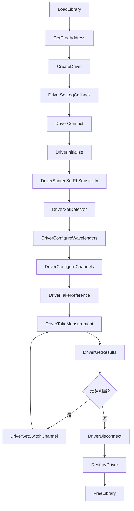

# UDL.SantecRLM 驱动接口文档

## 概述

| 属性 | 值 |
|---|---|
| DLL 名称 | `UDL.SantecRLM.dll` |
| 用途 | Santec RL1 回波损耗计驱动 |
| 目标设备 | Santec RL1 系列回波损耗测量仪 |
| 通信方式 | TCP/IP（默认）、GPIB、USB (VISA) |
| 默认端口 | 由设备配置决定 |
| 函数前缀 | `Driver` / `Create` / `Destroy`（无下划线分隔） |
| 调用约定 | `__stdcall` (WINAPI) |
| 加载方式 | `LoadLibrary` + `GetProcAddress` 动态加载 |

RLM 驱动用于控制 Santec RL1 回波损耗计，支持插入损耗（IL）、回波损耗（RL）、连接器级回波损耗（RLA/RLB）、总回波损耗（RLTotal）以及 DUT 长度测量。支持双探测器、外部光开关集成控制。

---

## 数据结构

### CMeasurementResult

单通道/单波长的测量结果。

```c
struct CMeasurementResult
{
    int    channel;           // 通道号
    double wavelength;        // 波长 (nm)
    double insertionLoss;     // 插入损耗 IL (dB)
    double returnLoss;        // 回波损耗 RL (dB)
    double returnLossA;       // 位置A连接器回波损耗 RLA (dB)
    double returnLossB;       // 位置B连接器回波损耗 RLB (dB)
    double returnLossTotal;   // 总回波损耗 RLTotal (dB)
    double dutLength;         // DUT 长度 (m)
    double rawData[10];       // 原始数据
    int    rawDataCount;      // 原始数据项数
};
```

### CDeviceInfo

设备识别信息。

```c
struct CDeviceInfo
{
    char manufacturer[64];    // 制造商
    char model[64];           // 型号
    char serialNumber[64];    // 序列号
    char firmwareVersion[64]; // 固件版本
    int  slot;                // 插槽号
};
```

### CConnectionConfig

连接配置。

```c
struct CConnectionConfig
{
    char   ipAddress[64];     // IP 地址
    int    port;              // TCP 端口
    double timeout;           // 超时（秒）
    int    bufferSize;        // 缓冲区大小
    int    reconnectAttempts; // 重连尝试次数
    double reconnectDelay;    // 重连延迟（秒）
};
```

---

## 枚举类型

### 测量模式 (MeasurementMode)

| 值 | 名称 | 说明 |
|---|---|---|
| 0 | MODE_REFERENCE | 参考测量模式 |
| 1 | MODE_MEASUREMENT | DUT 测量模式 |

### 测量状态 (MeasurementState)

| 值 | 名称 | 说明 |
|---|---|---|
| 0 | MEAS_IDLE | 空闲 |
| 1 | MEAS_COMPLETE | 测量完成 |
| 2 | MEAS_RUNNING | 测量进行中 |
| 3 | MEAS_ERROR | 测量错误 |

### 连接状态 (ConnectionState)

| 值 | 名称 | 说明 |
|---|---|---|
| 0 | STATE_DISCONNECTED | 已断开 |
| 1 | STATE_CONNECTING | 正在连接 |
| 2 | STATE_CONNECTED | 已连接 |
| 3 | STATE_ERROR | 连接错误 |

### 通信类型 (CommType)

| 值 | 名称 | 说明 |
|---|---|---|
| 0 | COMM_TCP | TCP/IP 连接 |
| 1 | COMM_GPIB | GPIB 连接 |
| 2 | COMM_USB | USB (VISA) 连接 |
| 3 | COMM_DLL | DLL 内部连接 |

### RL 灵敏度

| 值 | 名称 | 说明 |
|---|---|---|
| 0 | 快速 | <1.5 秒, RL 测量范围 ≤75 dB |
| 1 | 标准 | <5 秒, RL 测量范围 ≤85 dB |

### RL 增益模式

| 值 | 名称 | 说明 |
|---|---|---|
| 0 | 正常 | 增益范围 40~85 dB |
| 1 | 低 | 增益范围 30~40 dB |

### DUT 长度档位

| 值 | 说明 |
|---|---|
| 100 | 短距 DUT（≤100 m） |
| 1500 | 中距 DUT（≤1500 m） |
| 4000 | 长距 DUT（≤4000 m） |

---

## API 函数列表

### 1. 驱动生命周期

#### CreateDriver

创建 RLM 驱动实例（TCP 模式）。

```c
HANDLE WINAPI CreateDriver(const char* type, const char* ip, int port, int slot);
```

| 参数 | 类型 | 说明 |
|---|---|---|
| type | `const char*` | 驱动类型标识，传 `"santec"` 或 `"rlm"` |
| ip | `const char*` | 设备 IP 地址 |
| port | `int` | TCP 端口，`0` 表示使用设备默认端口 |
| slot | `int` | 保留参数，传 `0` |

**返回值**: `HANDLE` -- 成功返回驱动句柄，失败返回 `NULL`。

#### CreateDriverEx

创建驱动实例（扩展版本，支持多种通信类型）。

```c
HANDLE WINAPI CreateDriverEx(const char* type, const char* address,
                              int port, int slot, int commType);
```

| 参数 | 类型 | 说明 |
|---|---|---|
| type | `const char*` | 驱动类型标识 |
| address | `const char*` | TCP 模式为 IP 地址，USB 模式为 VISA 资源字符串 |
| port | `int` | TCP 端口（USB 模式忽略） |
| slot | `int` | 保留参数 |
| commType | `int` | 通信类型：0=TCP, 1=GPIB, 2=USB(VISA) |

**返回值**: `HANDLE` -- 成功返回驱动句柄，失败返回 `NULL`。

#### DestroyDriver

销毁驱动实例并释放资源。

```c
void WINAPI DestroyDriver(HANDLE hDriver);
```

---

### 2. 连接管理

#### DriverConnect

连接到设备。

```c
BOOL WINAPI DriverConnect(HANDLE hDriver);
```

**返回值**: `TRUE` 成功，`FALSE` 失败。

#### DriverDisconnect

断开连接。

```c
void WINAPI DriverDisconnect(HANDLE hDriver);
```

#### DriverInitialize

连接后初始化设备（远程模式、读取配置）。

```c
BOOL WINAPI DriverInitialize(HANDLE hDriver);
```

**返回值**: `TRUE` 成功，`FALSE` 失败。

#### DriverIsConnected

检查是否已连接。

```c
BOOL WINAPI DriverIsConnected(HANDLE hDriver);
```

---

### 3. 测量配置

#### DriverConfigureWavelengths

配置测量波长。

```c
BOOL WINAPI DriverConfigureWavelengths(HANDLE hDriver, double* wavelengths, int count);
```

| 参数 | 类型 | 说明 |
|---|---|---|
| wavelengths | `double*` | 波长数组，单位 nm（如 1310.0, 1550.0） |
| count | `int` | 波长数量 |

**返回值**: `TRUE` 成功，`FALSE` 失败。

#### DriverConfigureChannels

配置测量通道。

```c
BOOL WINAPI DriverConfigureChannels(HANDLE hDriver, int* channels, int count);
```

| 参数 | 类型 | 说明 |
|---|---|---|
| channels | `int*` | 通道号数组 |
| count | `int` | 通道数量 |

**返回值**: `TRUE` 成功，`FALSE` 失败。

---

### 4. Santec RL1 特定配置

#### DriverSantecSetRLSensitivity

设置回波损耗灵敏度。

```c
BOOL WINAPI DriverSantecSetRLSensitivity(HANDLE hDriver, int sensitivity);
```

| 参数 | 类型 | 说明 |
|---|---|---|
| sensitivity | `int` | 0=快速 (<1.5s, ≤75dB), 1=标准 (<5s, ≤85dB) |

**返回值**: `TRUE` 成功，`FALSE` 失败。

#### DriverSantecSetDUTLength

设置 DUT 长度档位。

```c
BOOL WINAPI DriverSantecSetDUTLength(HANDLE hDriver, int lengthBin);
```

| 参数 | 类型 | 说明 |
|---|---|---|
| lengthBin | `int` | DUT 长度档位：100、1500 或 4000（米） |

#### DriverSantecSetRLGain

设置回波损耗增益模式。

```c
BOOL WINAPI DriverSantecSetRLGain(HANDLE hDriver, int gain);
```

| 参数 | 类型 | 说明 |
|---|---|---|
| gain | `int` | 0=正常 (40-85dB), 1=低 (30-40dB) |

#### DriverSantecSetLocalMode

设置本地/远程模式。

```c
BOOL WINAPI DriverSantecSetLocalMode(HANDLE hDriver, BOOL enabled);
```

| 参数 | 类型 | 说明 |
|---|---|---|
| enabled | `BOOL` | `TRUE`=本地模式（触摸屏可用）, `FALSE`=远程模式 |

---

### 5. 探测器管理

#### DriverSetDetector

设置当前活动探测器。

```c
BOOL WINAPI DriverSetDetector(HANDLE hDriver, int detectorNum);
```

| 参数 | 类型 | 说明 |
|---|---|---|
| detectorNum | `int` | 1=内置前面板探测器, 2=外部遥控探头 |

#### DriverGetDetectorCount

获取已连接的探测器数量。

```c
int WINAPI DriverGetDetectorCount(HANDLE hDriver);
```

**返回值**: 探测器数量。

#### DriverGetDetectorInfo

获取指定探测器的信息。

```c
BOOL WINAPI DriverGetDetectorInfo(HANDLE hDriver, int detectorNum,
                                   char* buffer, int bufferSize);
```

| 参数 | 类型 | 说明 |
|---|---|---|
| detectorNum | `int` | 探测器编号 |
| buffer | `char*` | 接收信息的缓冲区 |
| bufferSize | `int` | 缓冲区大小 |

**返回值**: `TRUE` 成功，`FALSE` 失败。

---

### 6. 测量操作

#### DriverTakeReference

执行参考（归零）测量。

```c
BOOL WINAPI DriverTakeReference(HANDLE hDriver, BOOL bOverride,
                                 double ilValue, double lengthValue);
```

| 参数 | 类型 | 说明 |
|---|---|---|
| bOverride | `BOOL` | `TRUE`=使用覆盖值, `FALSE`=自动测量 |
| ilValue | `double` | 覆盖 IL 值 (dB) |
| lengthValue | `double` | 覆盖长度值 (m) |

**返回值**: `TRUE` 参考测量成功，`FALSE` 失败。

> 阻塞调用，直到测量完成或超时才返回。

#### DriverTakeMeasurement

执行 DUT 测量。

```c
BOOL WINAPI DriverTakeMeasurement(HANDLE hDriver);
```

**返回值**: `TRUE` 成功，`FALSE` 失败。

> 阻塞调用。完成后通过 `DriverGetResults` 获取结果。

#### DriverGetResults

获取测量结果。

```c
int WINAPI DriverGetResults(HANDLE hDriver, CMeasurementResult* results, int maxCount);
```

| 参数 | 类型 | 说明 |
|---|---|---|
| results | `CMeasurementResult*` | 预分配的结果数组 |
| maxCount | `int` | 数组最大容量 |

**返回值**: 实际写入的结果数量。

---

### 7. 外部光开关控制

RL1 通过 USB-A 端口可连接外部 Santec OSX 光开关，实现集成自动化测试。

#### DriverSetSwitchChannel

设置外部开关通道。

```c
BOOL WINAPI DriverSetSwitchChannel(HANDLE hDriver, int switchNum, int channel);
```

| 参数 | 类型 | 说明 |
|---|---|---|
| switchNum | `int` | 开关编号：0=内部, 1=SW1, 2=SW2 |
| channel | `int` | 目标通道号 |

**返回值**: `TRUE` 成功，`FALSE` 失败。

#### DriverGetSwitchChannel

查询外部开关当前通道。

```c
int WINAPI DriverGetSwitchChannel(HANDLE hDriver, int switchNum);
```

**返回值**: 当前通道号。

#### DriverGetSwitchInfo

查询外部开关信息。

```c
BOOL WINAPI DriverGetSwitchInfo(HANDLE hDriver, int switchNum,
                                 char* buffer, int bufferSize);
```

| 参数 | 类型 | 说明 |
|---|---|---|
| switchNum | `int` | 开关编号 |
| buffer | `char*` | 接收信息的缓冲区 |
| bufferSize | `int` | 缓冲区大小 |

---

### 8. 设备信息

#### DriverGetDeviceInfo

获取设备识别信息。

```c
BOOL WINAPI DriverGetDeviceInfo(HANDLE hDriver, CDeviceInfo* info);
```

#### DriverCheckError

查询设备最近的错误。

```c
int WINAPI DriverCheckError(HANDLE hDriver, char* message, int messageSize);
```

**返回值**: 错误代码（0 = 无错误）。

---

### 9. 原始 SCPI 命令

#### DriverSendCommand

发送原始 SCPI 命令并接收响应。

```c
BOOL WINAPI DriverSendCommand(HANDLE hDriver, const char* command,
                               char* response, int responseSize);
```

---

### 10. 日志

#### DriverSetLogCallback

设置日志回调函数。

```c
typedef void (WINAPI *DriverLogCallback)(int level, const char* source, const char* message);

void WINAPI DriverSetLogCallback(DriverLogCallback callback);
```

---

### 11. VISA 枚举

#### EnumerateVisaResources

枚举可用的 VISA 资源。

```c
int WINAPI EnumerateVisaResources(char* buffer, int bufferSize);
```

**返回值**: 找到的资源数量。`buffer` 中以分号分隔各资源字符串。

---

## 调用流程



---

## 调用 Demo

```cpp
#include <Windows.h>
#include <cstdio>

// ---- 数据结构（与 DLL 导出对齐）----

struct CMeasurementResult
{
    int    channel;
    double wavelength;
    double insertionLoss;
    double returnLoss;
    double returnLossA;
    double returnLossB;
    double returnLossTotal;
    double dutLength;
    double rawData[10];
    int    rawDataCount;
};

struct CDeviceInfo
{
    char manufacturer[64];
    char model[64];
    char serialNumber[64];
    char firmwareVersion[64];
    int  slot;
};

// ---- 函数指针类型 ----

typedef HANDLE (WINAPI *PFN_CreateDriver)(const char*, const char*, int, int);
typedef void   (WINAPI *PFN_DestroyDriver)(HANDLE);
typedef BOOL   (WINAPI *PFN_DriverConnect)(HANDLE);
typedef void   (WINAPI *PFN_DriverDisconnect)(HANDLE);
typedef BOOL   (WINAPI *PFN_DriverInitialize)(HANDLE);
typedef BOOL   (WINAPI *PFN_DriverIsConnected)(HANDLE);
typedef BOOL   (WINAPI *PFN_DriverConfigureWavelengths)(HANDLE, double*, int);
typedef BOOL   (WINAPI *PFN_DriverConfigureChannels)(HANDLE, int*, int);
typedef BOOL   (WINAPI *PFN_DriverTakeReference)(HANDLE, BOOL, double, double);
typedef BOOL   (WINAPI *PFN_DriverTakeMeasurement)(HANDLE);
typedef int    (WINAPI *PFN_DriverGetResults)(HANDLE, CMeasurementResult*, int);
typedef BOOL   (WINAPI *PFN_DriverGetDeviceInfo)(HANDLE, CDeviceInfo*);
typedef BOOL   (WINAPI *PFN_DriverSantecSetRLSensitivity)(HANDLE, int);
typedef BOOL   (WINAPI *PFN_DriverSantecSetDUTLength)(HANDLE, int);
typedef BOOL   (WINAPI *PFN_DriverSantecSetRLGain)(HANDLE, int);
typedef BOOL   (WINAPI *PFN_DriverSetDetector)(HANDLE, int);
typedef int    (WINAPI *PFN_DriverGetDetectorCount)(HANDLE);
typedef BOOL   (WINAPI *PFN_DriverSetSwitchChannel)(HANDLE, int, int);
typedef int    (WINAPI *PFN_DriverGetSwitchChannel)(HANDLE, int);
typedef void   (WINAPI *PFN_DriverLogCallback)(int, const char*, const char*);
typedef void   (WINAPI *PFN_DriverSetLogCallback)(PFN_DriverLogCallback);

// ---- 日志回调 ----

void WINAPI MyRLMLog(int level, const char* source, const char* message)
{
    static const char* levels[] = { "DEBUG", "INFO", "WARN", "ERROR" };
    printf("[RLM][%s] %s\n", (level >= 0 && level <= 3) ? levels[level] : "???", message);
}

// ---- 主程序 ----

int main()
{
    // 1. 加载 DLL
    HMODULE hDll = LoadLibraryA("UDL.SantecRLM.dll");
    if (!hDll) { printf("无法加载 DLL\n"); return 1; }

    // 2. 解析函数地址
    auto pfnCreate       = (PFN_CreateDriver)GetProcAddress(hDll, "CreateDriver");
    auto pfnDestroy      = (PFN_DestroyDriver)GetProcAddress(hDll, "DestroyDriver");
    auto pfnConnect      = (PFN_DriverConnect)GetProcAddress(hDll, "DriverConnect");
    auto pfnDisconnect   = (PFN_DriverDisconnect)GetProcAddress(hDll, "DriverDisconnect");
    auto pfnInit         = (PFN_DriverInitialize)GetProcAddress(hDll, "DriverInitialize");
    auto pfnConfWL       = (PFN_DriverConfigureWavelengths)GetProcAddress(hDll, "DriverConfigureWavelengths");
    auto pfnConfCH       = (PFN_DriverConfigureChannels)GetProcAddress(hDll, "DriverConfigureChannels");
    auto pfnRef          = (PFN_DriverTakeReference)GetProcAddress(hDll, "DriverTakeReference");
    auto pfnMeas         = (PFN_DriverTakeMeasurement)GetProcAddress(hDll, "DriverTakeMeasurement");
    auto pfnGetResults   = (PFN_DriverGetResults)GetProcAddress(hDll, "DriverGetResults");
    auto pfnGetInfo      = (PFN_DriverGetDeviceInfo)GetProcAddress(hDll, "DriverGetDeviceInfo");
    auto pfnSetSens      = (PFN_DriverSantecSetRLSensitivity)GetProcAddress(hDll, "DriverSantecSetRLSensitivity");
    auto pfnSetDUTLen    = (PFN_DriverSantecSetDUTLength)GetProcAddress(hDll, "DriverSantecSetDUTLength");
    auto pfnSetGain      = (PFN_DriverSantecSetRLGain)GetProcAddress(hDll, "DriverSantecSetRLGain");
    auto pfnSetDetector  = (PFN_DriverSetDetector)GetProcAddress(hDll, "DriverSetDetector");
    auto pfnSetSwitch    = (PFN_DriverSetSwitchChannel)GetProcAddress(hDll, "DriverSetSwitchChannel");
    auto pfnGetSwitch    = (PFN_DriverGetSwitchChannel)GetProcAddress(hDll, "DriverGetSwitchChannel");
    auto pfnSetLog       = (PFN_DriverSetLogCallback)GetProcAddress(hDll, "DriverSetLogCallback");

    // 3. 设置日志
    if (pfnSetLog) pfnSetLog(MyRLMLog);

    // 4. 创建驱动并连接
    HANDLE hDriver = pfnCreate("santec", "10.14.132.194", 0, 0);
    if (!hDriver) { printf("创建驱动失败\n"); FreeLibrary(hDll); return 1; }

    if (!pfnConnect(hDriver)) { printf("连接失败\n"); goto cleanup; }
    pfnInit(hDriver);

    // 5. 获取设备信息
    {
        CDeviceInfo info = {};
        if (pfnGetInfo(hDriver, &info))
            printf("设备: %s %s SN=%s FW=%s\n",
                   info.manufacturer, info.model,
                   info.serialNumber, info.firmwareVersion);
    }

    // 6. 配置 RL1 参数
    pfnSetSens(hDriver, 1);        // 标准灵敏度
    pfnSetDUTLen(hDriver, 100);    // 短距 DUT
    pfnSetGain(hDriver, 0);        // 正常增益
    pfnSetDetector(hDriver, 1);    // 内置前面板探测器

    // 7. 配置波长和通道
    {
        double wavelengths[] = { 1310.0, 1550.0 };
        pfnConfWL(hDriver, wavelengths, 2);

        int channels[] = { 1 };
        pfnConfCH(hDriver, channels, 1);
    }

    // 8. 参考测量
    printf("开始参考测量...\n");
    if (!pfnRef(hDriver, FALSE, 0.0, 0.0))
    {
        printf("参考测量失败\n");
        goto cleanup;
    }
    printf("参考测量完成\n");

    // 9. DUT 测量
    printf("开始 DUT 测量...\n");
    if (pfnMeas(hDriver))
    {
        CMeasurementResult results[64];
        int count = pfnGetResults(hDriver, results, 64);
        printf("获得 %d 条测量结果:\n", count);

        for (int i = 0; i < count; i++)
        {
            printf("  CH%d @%.0fnm: IL=%.2f dB, RL=%.2f dB, "
                   "RLA=%.2f dB, RLB=%.2f dB, RLTotal=%.2f dB, Len=%.2f m\n",
                   results[i].channel,
                   results[i].wavelength,
                   results[i].insertionLoss,
                   results[i].returnLoss,
                   results[i].returnLossA,
                   results[i].returnLossB,
                   results[i].returnLossTotal,
                   results[i].dutLength);
        }
    }
    else
    {
        printf("DUT 测量失败\n");
    }

    // 10. 外部光开关控制（可选）
    if (pfnSetSwitch && pfnGetSwitch)
    {
        printf("\n外部光开关控制:\n");
        for (int ch = 1; ch <= 4; ch++)
        {
            pfnSetSwitch(hDriver, 1, ch);  // SW1 切换到通道 ch
            int current = pfnGetSwitch(hDriver, 1);
            printf("  SW1 切换到通道 %d, 当前=%d\n", ch, current);

            // 在此执行测量...
            if (pfnMeas(hDriver))
            {
                CMeasurementResult res[16];
                int cnt = pfnGetResults(hDriver, res, 16);
                for (int j = 0; j < cnt; j++)
                    printf("    @%.0fnm: IL=%.2f RL=%.2f\n",
                           res[j].wavelength, res[j].insertionLoss, res[j].returnLoss);
            }
        }
    }

cleanup:
    pfnDisconnect(hDriver);
    pfnDestroy(hDriver);
    FreeLibrary(hDll);
    return 0;
}
```

---

## 注意事项

1. **函数命名**: 与其他三个驱动不同，SantecRLM 的导出函数名没有统一前缀下划线分隔（如 `CreateDriver` 而非 `RLM_CreateDriver`）。注意 `GetProcAddress` 传入的导出名称。
2. **阻塞调用**: `DriverTakeReference` 和 `DriverTakeMeasurement` 是阻塞函数。标准灵敏度模式下单波长测量约 5 秒。
3. **灵敏度与速度**: 快速模式（0）约 1.5 秒但 RL 上限 75 dB；标准模式（1）约 5 秒但 RL 上限 85 dB。根据被测器件要求选择。
4. **外部光开关**: 通过 `DriverSetSwitchChannel` / `DriverGetSwitchChannel` 控制 USB 连接的 Santec OSX 光开关，实现多通道自动化测试。`switchNum=0` 为内部开关，`1`/`2` 为外部 SW1/SW2。
5. **探测器选择**: 使用前通过 `DriverGetDetectorCount` 确认探测器数量，`DriverSetDetector(1)` 选择前面板内置探测器，`DriverSetDetector(2)` 选择外部遥控探头。
6. **RLA/RLB 含义**: RLA 为位置A（近端）连接器的回波损耗，RLB 为位置B（远端）连接器的回波损耗，RLTotal 为整段光纤的总回波损耗。
