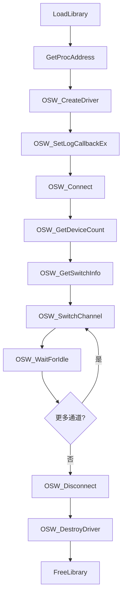

# UDL.ViaviOSW 驱动接口文档

## 概述

| 属性 | 值 |
|---|---|
| DLL 名称 | `UDL.ViaviOSW.dll` |
| 用途 | Viavi MAP 光开关（OSW）驱动 |
| 目标设备 | Viavi MAP mOSW-C1 光开关卡带 |
| 通信方式 | TCP/IP（默认）、GPIB、VISA |
| 默认端口 | 8203 |
| 函数前缀 | `OSW_` |
| 调用约定 | `__stdcall` (WINAPI) |
| 加载方式 | `LoadLibrary` + `GetProcAddress` 动态加载 |

OSW 驱动用于控制 Viavi MAP 系列的光开关卡带，支持 1xN 通道切换，通常与 PCT 驱动配合使用实现多通道自动化测试。

---

## 数据结构

### CDeviceInfo

设备识别信息。

```c
struct CDeviceInfo
{
    char serialNumber[64];    // 序列号
    char partNumber[64];      // 部件号
    char firmwareVersion[64]; // 固件版本
    char description[128];    // 设备描述
    int  slot;                // 插槽号
};
```

### CSwitchInfo

开关信息（从 `:CONF?` 解析）。

```c
struct CSwitchInfo
{
    int  deviceNum;           // 设备编号
    char description[128];    // 描述（如 "OSW"）
    int  switchType;          // 开关类型：0=1xN, 1=双1xN, 2=1xN+直通, 3=双重1xN
    int  channelCount;        // 通道数量（如 24）
    int  currentChannel;      // 当前通道
};
```

---

## 枚举类型

### 开关类型

| 值 | 名称 | 说明 |
|---|---|---|
| 0 | SWITCH_1C | 1xN 通道切换 |
| 1 | SWITCH_2D | 双 1xN 切换 |
| 2 | SWITCH_2E | 1xN + 直通 |
| 3 | SWITCH_2X | 双重 1xN |

### 日志级别

| 值 | 名称 | 说明 |
|---|---|---|
| 0 | LOG_DEBUG | 调试信息 |
| 1 | LOG_INFO | 一般信息 |
| 2 | LOG_WARNING | 警告 |
| 3 | LOG_ERROR | 错误 |

### 通信类型（CreateDriverEx）

| 值 | 名称 | 说明 |
|---|---|---|
| 0 | COMM_TCP | TCP/IP 连接 |
| 1 | COMM_GPIB | GPIB 连接 |
| 2 | COMM_VISA | VISA 连接 |

---

## API 函数列表

### 1. 驱动生命周期

#### OSW_CreateDriver

创建 OSW 驱动实例（TCP 模式）。

```c
HANDLE WINAPI OSW_CreateDriver(const char* ip, int port);
```

| 参数 | 类型 | 说明 |
|---|---|---|
| ip | `const char*` | MAP 系统 IP 地址 |
| port | `int` | OSW 模块 TCP 端口，`0` 表示使用默认端口 8203 |

**返回值**: `HANDLE` -- 成功返回驱动句柄，失败返回 `NULL`。

#### OSW_CreateDriverEx

创建驱动实例（扩展版本，支持多种通信类型）。

```c
HANDLE WINAPI OSW_CreateDriverEx(const char* address, int port, int commType);
```

| 参数 | 类型 | 说明 |
|---|---|---|
| address | `const char*` | TCP 模式为 IP 地址，VISA 模式为 VISA 资源字符串 |
| port | `int` | TCP 端口（VISA 模式忽略） |
| commType | `int` | 通信类型：0=TCP, 1=GPIB, 2=VISA |

**返回值**: `HANDLE` -- 成功返回驱动句柄，失败返回 `NULL`。

#### OSW_DestroyDriver

销毁驱动实例并释放资源。

```c
void WINAPI OSW_DestroyDriver(HANDLE hDriver);
```

---

### 2. 连接管理

#### OSW_Connect

连接到设备。

```c
BOOL WINAPI OSW_Connect(HANDLE hDriver);
```

**返回值**: `TRUE` 连接成功，`FALSE` 失败。

#### OSW_Disconnect

断开连接。

```c
void WINAPI OSW_Disconnect(HANDLE hDriver);
```

#### OSW_IsConnected

检查是否已连接。

```c
BOOL WINAPI OSW_IsConnected(HANDLE hDriver);
```

---

### 3. 设备信息

#### OSW_GetDeviceInfo

获取设备识别信息。

```c
BOOL WINAPI OSW_GetDeviceInfo(HANDLE hDriver, CDeviceInfo* info);
```

**返回值**: `TRUE` 成功，`FALSE` 失败。

#### OSW_CheckError

查询设备最近的错误。

```c
int WINAPI OSW_CheckError(HANDLE hDriver, char* message, int messageSize);
```

**返回值**: 错误代码（0 = 无错误）。

---

### 4. 开关信息

#### OSW_GetDeviceCount

获取设备（开关）数量。

```c
int WINAPI OSW_GetDeviceCount(HANDLE hDriver);
```

**返回值**: 设备数量。

#### OSW_GetSwitchInfo

获取指定设备的开关信息。

```c
BOOL WINAPI OSW_GetSwitchInfo(HANDLE hDriver, int deviceNum, CSwitchInfo* info);
```

| 参数 | 类型 | 说明 |
|---|---|---|
| deviceNum | `int` | 设备编号（从 1 开始） |
| info | `CSwitchInfo*` | 接收开关信息 |

**返回值**: `TRUE` 成功，`FALSE` 失败。

---

### 5. 通道切换

#### OSW_SwitchChannel

切换指定设备到目标通道。

```c
BOOL WINAPI OSW_SwitchChannel(HANDLE hDriver, int deviceNum, int channel);
```

| 参数 | 类型 | 说明 |
|---|---|---|
| deviceNum | `int` | 设备编号（从 1 开始） |
| channel | `int` | 目标通道号（从 1 开始） |

**返回值**: `TRUE` 成功，`FALSE` 失败。

> 内部自动执行 `WaitForIdle`，切换完成后才返回。

#### OSW_GetCurrentChannel

获取当前通道号。

```c
int WINAPI OSW_GetCurrentChannel(HANDLE hDriver, int deviceNum);
```

**返回值**: 当前通道号。

#### OSW_GetChannelCount

获取通道总数。

```c
int WINAPI OSW_GetChannelCount(HANDLE hDriver, int deviceNum);
```

**返回值**: 通道总数。

---

### 6. 控制

#### OSW_SetLocalMode

设置本地/远程模式。

```c
BOOL WINAPI OSW_SetLocalMode(HANDLE hDriver, BOOL local);
```

| 参数 | 类型 | 说明 |
|---|---|---|
| local | `BOOL` | `TRUE`=本地模式, `FALSE`=远程模式 |

#### OSW_Reset

重置设备。

```c
BOOL WINAPI OSW_Reset(HANDLE hDriver);
```

---

### 7. 操作同步

#### OSW_WaitForIdle

等待设备空闲。

```c
BOOL WINAPI OSW_WaitForIdle(HANDLE hDriver, int timeoutMs);
```

| 参数 | 类型 | 说明 |
|---|---|---|
| timeoutMs | `int` | 超时时间（毫秒） |

**返回值**: `TRUE` 设备已空闲，`FALSE` 超时。

---

### 8. 原始 SCPI 命令

#### OSW_SendCommand

发送原始 SCPI 命令。

```c
BOOL WINAPI OSW_SendCommand(HANDLE hDriver, const char* command,
                             char* response, int responseSize);
```

---

### 9. 日志

#### OSW_SetLogCallback

设置全局日志回调（所有 OSW 实例共享）。

```c
typedef void (WINAPI *OSWLogCallback)(int level, const char* source, const char* message);

void WINAPI OSW_SetLogCallback(OSWLogCallback callback);
```

#### OSW_SetLogCallbackEx

设置指定驱动实例的日志回调（多实例场景下区分日志来源）。

```c
void WINAPI OSW_SetLogCallbackEx(HANDLE hDriver, OSWLogCallback callback);
```

> 当同时加载两个 OSW 实例（如 OSW1 和 OSW2）时，使用 `SetLogCallbackEx` 为每个实例设置独立回调，避免日志混淆。

---

### 10. VISA 枚举

#### OSW_EnumerateVisaResources

枚举可用的 VISA 资源。

```c
int WINAPI OSW_EnumerateVisaResources(char* buffer, int bufferSize);
```

**返回值**: 找到的资源数量。

---

## 调用流程



---

## 调用 Demo

```cpp
#include <Windows.h>
#include <cstdio>

// ---- 数据结构 ----

struct CDeviceInfo
{
    char serialNumber[64];
    char partNumber[64];
    char firmwareVersion[64];
    char description[128];
    int  slot;
};

struct CSwitchInfo
{
    int  deviceNum;
    char description[128];
    int  switchType;
    int  channelCount;
    int  currentChannel;
};

// ---- 函数指针类型 ----

typedef HANDLE (WINAPI *PFN_OSW_CreateDriver)(const char*, int);
typedef void   (WINAPI *PFN_OSW_DestroyDriver)(HANDLE);
typedef BOOL   (WINAPI *PFN_OSW_Connect)(HANDLE);
typedef void   (WINAPI *PFN_OSW_Disconnect)(HANDLE);
typedef BOOL   (WINAPI *PFN_OSW_GetDeviceInfo)(HANDLE, CDeviceInfo*);
typedef int    (WINAPI *PFN_OSW_GetDeviceCount)(HANDLE);
typedef BOOL   (WINAPI *PFN_OSW_GetSwitchInfo)(HANDLE, int, CSwitchInfo*);
typedef BOOL   (WINAPI *PFN_OSW_SwitchChannel)(HANDLE, int, int);
typedef int    (WINAPI *PFN_OSW_GetCurrentChannel)(HANDLE, int);
typedef BOOL   (WINAPI *PFN_OSW_WaitForIdle)(HANDLE, int);
typedef void   (WINAPI *PFN_OSWLogCallback)(int, const char*, const char*);
typedef void   (WINAPI *PFN_OSW_SetLogCallback)(PFN_OSWLogCallback);
typedef void   (WINAPI *PFN_OSW_SetLogCallbackEx)(HANDLE, PFN_OSWLogCallback);

// ---- 日志回调 ----

void WINAPI MyOSWLog(int level, const char* source, const char* message)
{
    static const char* levels[] = { "DEBUG", "INFO", "WARN", "ERROR" };
    printf("[OSW][%s] %s\n", (level >= 0 && level <= 3) ? levels[level] : "???", message);
}

// ---- 主程序 ----

int main()
{
    // 1. 加载 DLL
    HMODULE hDll = LoadLibraryA("UDL.ViaviOSW.dll");
    if (!hDll) { printf("无法加载 DLL\n"); return 1; }

    // 2. 解析函数地址
    auto pfnCreate     = (PFN_OSW_CreateDriver)GetProcAddress(hDll, "OSW_CreateDriver");
    auto pfnDestroy    = (PFN_OSW_DestroyDriver)GetProcAddress(hDll, "OSW_DestroyDriver");
    auto pfnConnect    = (PFN_OSW_Connect)GetProcAddress(hDll, "OSW_Connect");
    auto pfnDisconnect = (PFN_OSW_Disconnect)GetProcAddress(hDll, "OSW_Disconnect");
    auto pfnGetInfo    = (PFN_OSW_GetDeviceInfo)GetProcAddress(hDll, "OSW_GetDeviceInfo");
    auto pfnDevCount   = (PFN_OSW_GetDeviceCount)GetProcAddress(hDll, "OSW_GetDeviceCount");
    auto pfnSwInfo     = (PFN_OSW_GetSwitchInfo)GetProcAddress(hDll, "OSW_GetSwitchInfo");
    auto pfnSwitch     = (PFN_OSW_SwitchChannel)GetProcAddress(hDll, "OSW_SwitchChannel");
    auto pfnGetCh      = (PFN_OSW_GetCurrentChannel)GetProcAddress(hDll, "OSW_GetCurrentChannel");
    auto pfnWait       = (PFN_OSW_WaitForIdle)GetProcAddress(hDll, "OSW_WaitForIdle");
    auto pfnSetLog     = (PFN_OSW_SetLogCallback)GetProcAddress(hDll, "OSW_SetLogCallback");
    auto pfnSetLogEx   = (PFN_OSW_SetLogCallbackEx)GetProcAddress(hDll, "OSW_SetLogCallbackEx");

    // 3. 设置全局日志
    if (pfnSetLog) pfnSetLog(MyOSWLog);

    // 4. 创建驱动并连接
    HANDLE hDriver = pfnCreate("172.16.154.87", 8202);
    if (!hDriver) { printf("创建驱动失败\n"); FreeLibrary(hDll); return 1; }

    // 为此实例设置独立日志回调
    if (pfnSetLogEx) pfnSetLogEx(hDriver, MyOSWLog);

    if (!pfnConnect(hDriver)) { printf("连接失败\n"); goto cleanup; }

    // 5. 获取设备信息
    {
        CDeviceInfo info = {};
        if (pfnGetInfo(hDriver, &info))
            printf("设备: SN=%s FW=%s\n", info.serialNumber, info.firmwareVersion);
    }

    // 6. 查询开关信息
    {
        int devCount = pfnDevCount(hDriver);
        printf("设备数量: %d\n", devCount);

        for (int d = 1; d <= devCount; d++)
        {
            CSwitchInfo swInfo = {};
            if (pfnSwInfo(hDriver, d, &swInfo))
                printf("  设备 %d: %d 通道, 当前通道=%d\n",
                       d, swInfo.channelCount, swInfo.currentChannel);
        }
    }

    // 7. 切换通道（遍历 1~24）
    for (int ch = 1; ch <= 24; ch++)
    {
        if (pfnSwitch(hDriver, 1, ch))
            printf("  已切换到通道 %d\n", ch);
        else
            printf("  切换到通道 %d 失败\n", ch);
    }

cleanup:
    pfnDisconnect(hDriver);
    pfnDestroy(hDriver);
    FreeLibrary(hDll);
    return 0;
}
```

---

## 注意事项

1. **多实例日志**: 同时使用两个 OSW（如 OSW1@8202 和 OSW2@8204）时，务必使用 `OSW_SetLogCallbackEx` 为每个实例设置独立回调以区分日志。
2. **通道切换阻塞**: `OSW_SwitchChannel` 内部包含 `WaitForIdle` 调用，切换完成后才返回。
3. **设备编号**: `deviceNum` 参数从 1 开始，通常为 1。
4. **日志编码**: 日志回调中 `message` 参数为 UTF-8 编码。
