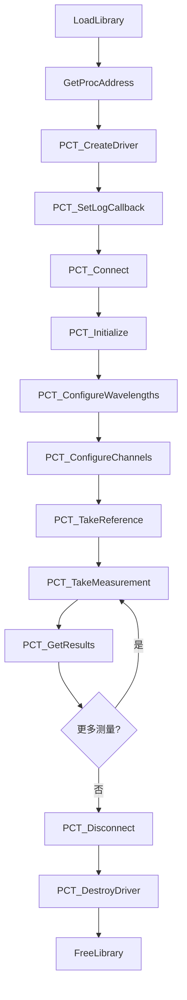

# UDL.ViaviPCT 驱动接口文档

## 概述

| 属性 | 值 |
|---|---|
| DLL 名称 | `UDL.ViaviPCT.dll` |
| 用途 | Viavi MAP 被动元件测试（PCT / mORL）驱动 |
| 目标设备 | Viavi MAP mORL-A1 模块 |
| 通信方式 | TCP/IP（默认）、GPIB、VISA |
| 默认端口 | 8301 |
| 函数前缀 | `PCT_` |
| 调用约定 | `__stdcall` (WINAPI) |
| 加载方式 | `LoadLibrary` + `GetProcAddress` 动态加载 |

PCT 驱动用于控制 Viavi MAP 系列的被动元件测试超级应用，支持插入损耗（IL）、回波损耗（ORL）、光功率、DUT 长度等测量。

---

## 数据结构

### CMeasurementResult

单通道/单波长的测量结果。

```c
struct CMeasurementResult
{
    int    channel;           // 通道号
    double wavelength;        // 波长 (nm)
    double insertionLoss;     // 插入损耗 IL (dB)
    double returnLoss;        // 回波损耗 ORL (dB)
    double returnLossZone1;   // 区域1 ORL (dB)
    double returnLossZone2;   // 区域2 ORL (dB)
    double dutLength;         // DUT 长度 (m)
    double power;             // 光功率 (dBm)
    double rawData[10];       // 原始数据
    int    rawDataCount;      // 原始数据项数
};
```

### CDeviceInfo

设备识别信息。

```c
struct CDeviceInfo
{
    char serialNumber[64];    // 序列号
    char partNumber[64];      // 部件号
    char firmwareVersion[64]; // 固件版本
    char description[128];    // 设备描述
    int  slot;                // 插槽号
};
```

---

## 枚举类型

### 测量模式

| 值 | 名称 | 说明 |
|---|---|---|
| 0 | MODE_REFERENCE | 参考测量模式 |
| 1 | MODE_DUT | DUT（被测器件）测量模式 |

### 日志级别

| 值 | 名称 | 说明 |
|---|---|---|
| 0 | LOG_DEBUG | 调试信息 |
| 1 | LOG_INFO | 一般信息 |
| 2 | LOG_WARNING | 警告 |
| 3 | LOG_ERROR | 错误 |

### 通信类型（CreateDriverEx）

| 值 | 名称 | 说明 |
|---|---|---|
| 0 | COMM_TCP | TCP/IP 连接 |
| 1 | COMM_GPIB | GPIB 连接 |
| 2 | COMM_VISA | VISA 连接 |

---

## API 函数列表

### 1. 驱动生命周期

#### PCT_CreateDriver

创建 PCT 驱动实例（TCP 模式）。

```c
HANDLE WINAPI PCT_CreateDriver(const char* type, const char* ip, int port, int slot);
```

| 参数 | 类型 | 说明 |
|---|---|---|
| type | `const char*` | 驱动类型标识，传 `"viavi"` 或 `"pct"` |
| ip | `const char*` | 设备 IP 地址 |
| port | `int` | TCP 端口，`0` 表示使用默认端口 8301 |
| slot | `int` | 保留参数，传 `0` |

**返回值**: `HANDLE` -- 成功返回驱动句柄，失败返回 `NULL`。

#### PCT_CreateDriverEx

创建驱动实例（扩展版本，支持多种通信类型）。

```c
HANDLE WINAPI PCT_CreateDriverEx(const char* type, const char* address,
                                  int port, int slot, int commType);
```

| 参数 | 类型 | 说明 |
|---|---|---|
| type | `const char*` | 驱动类型标识 |
| address | `const char*` | TCP 模式为 IP 地址，VISA 模式为 VISA 资源字符串 |
| port | `int` | TCP 端口（VISA 模式忽略） |
| slot | `int` | 保留参数 |
| commType | `int` | 通信类型：0=TCP, 1=GPIB, 2=VISA |

**返回值**: `HANDLE` -- 成功返回驱动句柄，失败返回 `NULL`。

#### PCT_DestroyDriver

销毁驱动实例并释放资源。

```c
void WINAPI PCT_DestroyDriver(HANDLE hDriver);
```

| 参数 | 类型 | 说明 |
|---|---|---|
| hDriver | `HANDLE` | 驱动句柄 |

---

### 2. 连接管理

#### PCT_Connect

连接到设备。

```c
BOOL WINAPI PCT_Connect(HANDLE hDriver);
```

**返回值**: `TRUE` 连接成功，`FALSE` 失败。

#### PCT_Disconnect

断开连接。

```c
void WINAPI PCT_Disconnect(HANDLE hDriver);
```

#### PCT_Initialize

连接后初始化设备（发送 `*REM` 远程模式、读取配置信息等）。

```c
BOOL WINAPI PCT_Initialize(HANDLE hDriver);
```

**返回值**: `TRUE` 初始化成功，`FALSE` 失败。

#### PCT_IsConnected

检查是否已连接。

```c
BOOL WINAPI PCT_IsConnected(HANDLE hDriver);
```

**返回值**: `TRUE` 已连接，`FALSE` 未连接。

---

### 3. 测量配置

#### PCT_ConfigureWavelengths

配置测量波长。

```c
BOOL WINAPI PCT_ConfigureWavelengths(HANDLE hDriver, double* wavelengths, int count);
```

| 参数 | 类型 | 说明 |
|---|---|---|
| hDriver | `HANDLE` | 驱动句柄 |
| wavelengths | `double*` | 波长数组，单位 nm（如 1310.0, 1550.0） |
| count | `int` | 波长数量 |

**返回值**: `TRUE` 成功，`FALSE` 失败。

#### PCT_ConfigureChannels

配置测量通道。

```c
BOOL WINAPI PCT_ConfigureChannels(HANDLE hDriver, int* channels, int count);
```

| 参数 | 类型 | 说明 |
|---|---|---|
| hDriver | `HANDLE` | 驱动句柄 |
| channels | `int*` | 通道号数组（如 1~24） |
| count | `int` | 通道数量 |

**返回值**: `TRUE` 成功，`FALSE` 失败。

#### PCT_SetMeasurementMode

设置测量模式。

```c
BOOL WINAPI PCT_SetMeasurementMode(HANDLE hDriver, int mode);
```

| 参数 | 类型 | 说明 |
|---|---|---|
| mode | `int` | 0=参考模式, 1=DUT 测量模式 |

**返回值**: `TRUE` 成功，`FALSE` 失败。

#### PCT_SetAveragingTime

设置平均测量时间。

```c
BOOL WINAPI PCT_SetAveragingTime(HANDLE hDriver, int seconds);
```

| 参数 | 类型 | 说明 |
|---|---|---|
| seconds | `int` | 平均时间（秒） |

#### PCT_SetDUTRange

设置 DUT 测量范围。

```c
BOOL WINAPI PCT_SetDUTRange(HANDLE hDriver, int rangeMeters);
```

| 参数 | 类型 | 说明 |
|---|---|---|
| rangeMeters | `int` | DUT 范围（米） |

---

### 4. 测量操作

#### PCT_TakeReference

执行参考（归零）测量。

```c
BOOL WINAPI PCT_TakeReference(HANDLE hDriver, BOOL bOverride,
                               double ilValue, double lengthValue);
```

| 参数 | 类型 | 说明 |
|---|---|---|
| hDriver | `HANDLE` | 驱动句柄 |
| bOverride | `BOOL` | `TRUE`=使用覆盖值, `FALSE`=自动测量 |
| ilValue | `double` | 覆盖 IL 值 (dB)，仅 `bOverride=TRUE` 时有效 |
| lengthValue | `double` | 覆盖长度值 (m)，仅 `bOverride=TRUE` 时有效 |

**返回值**: `TRUE` 参考测量成功，`FALSE` 失败。

> 此函数为阻塞调用，直到测量完成或超时（默认 180 秒）才返回。

#### PCT_TakeMeasurement

执行 DUT 测量。

```c
BOOL WINAPI PCT_TakeMeasurement(HANDLE hDriver);
```

**返回值**: `TRUE` 测量成功，`FALSE` 失败。

> 此函数为阻塞调用。测量完成后通过 `PCT_GetResults` 获取结果。

#### PCT_AbortMeasurement

中止正在进行的测量。可在任意线程调用（线程安全）。

```c
void WINAPI PCT_AbortMeasurement(HANDLE hDriver);
```

> 在另一个线程调用此函数后，正在阻塞的 `TakeReference` 或 `TakeMeasurement` 将在数秒内返回 `FALSE`。

#### PCT_GetResults

获取测量结果。

```c
int WINAPI PCT_GetResults(HANDLE hDriver, CMeasurementResult* results, int maxCount);
```

| 参数 | 类型 | 说明 |
|---|---|---|
| hDriver | `HANDLE` | 驱动句柄 |
| results | `CMeasurementResult*` | 预分配的结果数组 |
| maxCount | `int` | 数组最大容量 |

**返回值**: 实际写入的结果数量。

> 配置 N 个通道和 M 个波长时，最多返回 N×M 条结果。

---

### 5. 设备信息

#### PCT_GetDeviceInfo

获取设备识别信息。

```c
BOOL WINAPI PCT_GetDeviceInfo(HANDLE hDriver, CDeviceInfo* info);
```

**返回值**: `TRUE` 成功，`FALSE` 失败。

#### PCT_CheckError

查询设备最近的错误。

```c
int WINAPI PCT_CheckError(HANDLE hDriver, char* message, int messageSize);
```

| 参数 | 类型 | 说明 |
|---|---|---|
| message | `char*` | 接收错误消息的缓冲区 |
| messageSize | `int` | 缓冲区大小 |

**返回值**: 错误代码（0 = 无错误）。

---

### 6. 原始 SCPI 命令

#### PCT_SendCommand

发送原始 SCPI 命令并接收响应。

```c
BOOL WINAPI PCT_SendCommand(HANDLE hDriver, const char* command,
                             char* response, int responseSize);
```

| 参数 | 类型 | 说明 |
|---|---|---|
| command | `const char*` | SCPI 命令字符串 |
| response | `char*` | 接收响应的缓冲区 |
| responseSize | `int` | 缓冲区大小 |

**返回值**: `TRUE` 成功，`FALSE` 失败。

---

### 7. 日志

#### PCT_SetLogCallback

设置日志回调函数，接收驱动运行时日志。

```c
typedef void (WINAPI *PCTLogCallback)(int level, const char* source, const char* message);

void WINAPI PCT_SetLogCallback(PCTLogCallback callback);
```

回调参数：
- `level`: 日志级别（0=DEBUG, 1=INFO, 2=WARNING, 3=ERROR）
- `source`: 日志源标识
- `message`: 日志内容（UTF-8 编码）

---

### 8. VISA 枚举

#### PCT_EnumerateVisaResources

枚举可用的 VISA 资源。

```c
int WINAPI PCT_EnumerateVisaResources(char* buffer, int bufferSize);
```

**返回值**: 找到的资源数量。`buffer` 中以分号分隔各资源字符串。

---

## 调用流程



---

## 调用 Demo

```cpp
#include <Windows.h>
#include <cstdio>

// ---- 数据结构（与 DLL 导出对齐）----

struct CMeasurementResult
{
    int    channel;
    double wavelength;
    double insertionLoss;
    double returnLoss;
    double returnLossZone1;
    double returnLossZone2;
    double dutLength;
    double power;
    double rawData[10];
    int    rawDataCount;
};

struct CDeviceInfo
{
    char serialNumber[64];
    char partNumber[64];
    char firmwareVersion[64];
    char description[128];
    int  slot;
};

// ---- 函数指针类型 ----

typedef HANDLE (WINAPI *PFN_PCT_CreateDriver)(const char*, const char*, int, int);
typedef void   (WINAPI *PFN_PCT_DestroyDriver)(HANDLE);
typedef BOOL   (WINAPI *PFN_PCT_Connect)(HANDLE);
typedef void   (WINAPI *PFN_PCT_Disconnect)(HANDLE);
typedef BOOL   (WINAPI *PFN_PCT_Initialize)(HANDLE);
typedef BOOL   (WINAPI *PFN_PCT_ConfigureWavelengths)(HANDLE, double*, int);
typedef BOOL   (WINAPI *PFN_PCT_ConfigureChannels)(HANDLE, int*, int);
typedef BOOL   (WINAPI *PFN_PCT_TakeReference)(HANDLE, BOOL, double, double);
typedef BOOL   (WINAPI *PFN_PCT_TakeMeasurement)(HANDLE);
typedef void   (WINAPI *PFN_PCT_AbortMeasurement)(HANDLE);
typedef int    (WINAPI *PFN_PCT_GetResults)(HANDLE, CMeasurementResult*, int);
typedef BOOL   (WINAPI *PFN_PCT_GetDeviceInfo)(HANDLE, CDeviceInfo*);
typedef void   (WINAPI *PFN_PCTLogCallback)(int, const char*, const char*);
typedef void   (WINAPI *PFN_PCT_SetLogCallback)(PFN_PCTLogCallback);

// ---- 日志回调 ----

void WINAPI MyLogCallback(int level, const char* source, const char* message)
{
    static const char* levels[] = { "DEBUG", "INFO", "WARN", "ERROR" };
    printf("[%s] %s\n", (level >= 0 && level <= 3) ? levels[level] : "???", message);
}

// ---- 主程序 ----

int main()
{
    // 1. 加载 DLL
    HMODULE hDll = LoadLibraryA("UDL.ViaviPCT.dll");
    if (!hDll) { printf("无法加载 DLL\n"); return 1; }

    // 2. 解析函数地址
    auto pfnCreate      = (PFN_PCT_CreateDriver)GetProcAddress(hDll, "PCT_CreateDriver");
    auto pfnDestroy     = (PFN_PCT_DestroyDriver)GetProcAddress(hDll, "PCT_DestroyDriver");
    auto pfnConnect     = (PFN_PCT_Connect)GetProcAddress(hDll, "PCT_Connect");
    auto pfnDisconnect  = (PFN_PCT_Disconnect)GetProcAddress(hDll, "PCT_Disconnect");
    auto pfnInit        = (PFN_PCT_Initialize)GetProcAddress(hDll, "PCT_Initialize");
    auto pfnConfWL      = (PFN_PCT_ConfigureWavelengths)GetProcAddress(hDll, "PCT_ConfigureWavelengths");
    auto pfnConfCH      = (PFN_PCT_ConfigureChannels)GetProcAddress(hDll, "PCT_ConfigureChannels");
    auto pfnRef         = (PFN_PCT_TakeReference)GetProcAddress(hDll, "PCT_TakeReference");
    auto pfnMeas        = (PFN_PCT_TakeMeasurement)GetProcAddress(hDll, "PCT_TakeMeasurement");
    auto pfnGetResults  = (PFN_PCT_GetResults)GetProcAddress(hDll, "PCT_GetResults");
    auto pfnGetInfo     = (PFN_PCT_GetDeviceInfo)GetProcAddress(hDll, "PCT_GetDeviceInfo");
    auto pfnSetLog      = (PFN_PCT_SetLogCallback)GetProcAddress(hDll, "PCT_SetLogCallback");

    // 3. 设置日志
    if (pfnSetLog) pfnSetLog(MyLogCallback);

    // 4. 创建驱动并连接
    HANDLE hDriver = pfnCreate("viavi", "172.16.154.87", 8301, 0);
    if (!hDriver) { printf("创建驱动失败\n"); FreeLibrary(hDll); return 1; }

    if (!pfnConnect(hDriver)) { printf("连接失败\n"); goto cleanup; }
    pfnInit(hDriver);

    // 5. 获取设备信息
    {
        CDeviceInfo info = {};
        if (pfnGetInfo(hDriver, &info))
            printf("设备: SN=%s FW=%s\n", info.serialNumber, info.firmwareVersion);
    }

    // 6. 配置波长和通道
    {
        double wavelengths[] = { 1310.0, 1550.0 };
        pfnConfWL(hDriver, wavelengths, 2);

        int channels[] = { 1, 2, 3, 4, 5, 6, 7, 8, 9, 10, 11, 12,
                           13, 14, 15, 16, 17, 18, 19, 20, 21, 22, 23, 24 };
        pfnConfCH(hDriver, channels, 24);
    }

    // 7. 参考测量（Override: IL=0.1dB, Length=3.0m）
    printf("开始参考测量...\n");
    if (!pfnRef(hDriver, TRUE, 0.1, 3.0))
    {
        printf("参考测量失败\n");
        goto cleanup;
    }
    printf("参考测量完成\n");

    // 8. DUT 测量
    printf("开始 DUT 测量...\n");
    if (pfnMeas(hDriver))
    {
        CMeasurementResult results[256];
        int count = pfnGetResults(hDriver, results, 256);
        printf("获得 %d 条测量结果:\n", count);

        for (int i = 0; i < count; i++)
        {
            printf("  CH%d @%.0fnm: IL=%.2f dB, ORL=%.2f dB, "
                   "Zone1=%.2f dB, Zone2=%.2f dB, Len=%.2f m, Pwr=%.2f dBm\n",
                   results[i].channel,
                   results[i].wavelength,
                   results[i].insertionLoss,
                   results[i].returnLoss,
                   results[i].returnLossZone1,
                   results[i].returnLossZone2,
                   results[i].dutLength,
                   results[i].power);
        }
    }
    else
    {
        printf("DUT 测量失败\n");
    }

cleanup:
    pfnDisconnect(hDriver);
    pfnDestroy(hDriver);
    FreeLibrary(hDll);
    return 0;
}
```

---

## 注意事项

1. **阻塞调用**: `PCT_TakeReference` 和 `PCT_TakeMeasurement` 是阻塞函数，多波长测量可能耗时 60~180 秒。建议在工作线程中调用，使用 `PCT_AbortMeasurement` 实现取消。
2. **多波长结果**: 配置 2 个波长 + 24 个通道时，`PCT_GetResults` 最多返回 48 条结果（每通道每波长一条）。
3. **调用顺序**: 必须按 `CreateDriver -> Connect -> Initialize -> Configure -> TakeReference -> TakeMeasurement -> GetResults` 的顺序调用。
4. **日志编码**: 日志回调中 `message` 参数为 UTF-8 编码，在 ANSI 环境下显示中文需要转换。
