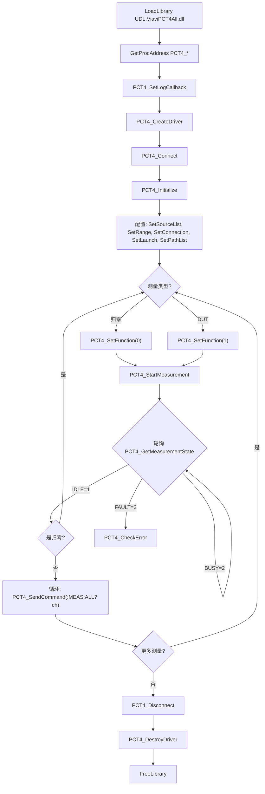

# UDL.ViaviPCT4All 驱动接口文档

## 概述

| 属性 | 值 |
|---|---|
| DLL 名称 | `UDL.ViaviPCT4All.dll` |
| 用途 | Viavi MAP PCT 全功能一体化驱动（含光开关控制） |
| 目标设备 | Viavi MAP-200 / MAP-300 系列 PCT / mORL 模块 |
| 参考文档 | MAP-PCT Programming Guide 22112369-346 R002 |
| 通信方式 | TCP/IP（默认）、VISA |
| 默认端口 | 8301（PCT 模块端口） |
| 函数前缀 | `PCT4_` |
| 调用约定 | `__stdcall` (WINAPI) |
| 加载方式 | `LoadLibrary` + `GetProcAddress` 动态加载 |

PCT4All 驱动严格对照 MAP-PCT Programming Guide 实现了全部 SCPI 指令，覆盖：
- **Appendix A**: Common SCPI Commands (`*CLS`, `*IDN?`, `*RST` 等)
- **Chapter 2**: Common Cassette Commands (`:BUSY?`, `:CONFig?`, `:INFOrmation?` 等)
- **Chapter 3**: System Commands (`:SYSTem:*`, `:SUPer:*`)
- **Chapter 4**: Factory Commands (`:FACTory:*`)
- **Chapter 5**: PCT Commands (`:MEASure:*`, `:PATH:*`, `:PMAP:*`, `:SENSe:*`, `:SOURce:*`, OPM)

与 `UDL.ViaviPCT` 的区别：光开关控制（`:PATH:LIST`、`:PATH:CHANnel`）已内置于本驱动，**无需**再使用独立的 `UDL.ViaviOSW` 驱动。

---

## 数据结构

### CIdentificationInfo

设备识别信息，由 `*IDN?` 解析。

```c
struct CIdentificationInfo
{
    char manufacturer[64];     // 制造商 (如 "VIAVI Solutions")
    char platform[64];         // 平台型号 (如 "MAP-200")
    char serialNumber[64];     // 主机序列号
    char firmwareVersion[64];  // 固件版本
};
```

### CCassetteInfo

模块（Cassette）信息，由 `:INFOrmation?` 解析。

```c
struct CCassetteInfo
{
    char serialNumber[64];     // 模块序列号
    char partNumber[64];       // 部件号
    char firmwareVersion[64];  // 模块固件版本
    char hardwareVersion[64];  // 硬件版本
    char assemblyDate[32];     // 组装日期
    char description[128];     // 模块描述 (如 "mORL-A1")
};
```

### CMeasurementResult

单通道/单波长测量结果。

```c
struct CMeasurementResult
{
    int    channel;            // 通道号
    double wavelength;         // 波长 (nm)
    double insertionLoss;      // 插入损耗 IL (dB)
    double returnLoss;         // 回波损耗 ORL (dB)
    double returnLossZone1;    // 区域1 ORL (dB)
    double returnLossZone2;    // 区域2 ORL (dB)
    double dutLength;          // DUT 长度 (m)
    double power;              // 光功率 (dBm)
    double ilOffset;           // IL 偏移 (dB)
    double rawData[10];        // 原始数据
    int    rawDataCount;       // 原始数据项数
};
```

---

## 枚举类型

### 测量模式（SENSe:FUNCtion）

| 值 | 名称 | 说明 |
|---|---|---|
| 0 | MODE_REFERENCE | 参考（归零）测量模式 |
| 1 | MODE_DUT | DUT（被测器件）测量模式 |

### 测量状态（MEASure:STATe?）

| 值 | 名称 | 说明 |
|---|---|---|
| 0 | MEAS_INITIALIZING | 初始化中 |
| 1 | MEAS_IDLE | 空闲（测量完成） |
| 2 | MEAS_BUSY | 测量忙 |
| 3 | MEAS_FAULT | 测量故障 |
| 4 | MEAS_SYSTEM | 系统功能 |

### 测量范围（SENSe:RANGe）

| 值 | 名称 | 说明 |
|---|---|---|
| 0 | RANGE_200M | 200 米 |
| 1 | RANGE_500M | 500 米 |
| 2 | RANGE_1KM | 1 公里 |
| 3 | RANGE_2KM | 2 公里 |
| 4 | RANGE_5KM | 5 公里 |
| 5 | RANGE_10KM | 10 公里 |

### 通信类型（CreateDriverEx）

| 值 | 名称 | 说明 |
|---|---|---|
| 0 | COMM_TCP | TCP/IP 连接 |
| 1 | COMM_GPIB | GPIB 连接（保留） |
| 2 | COMM_VISA | VISA 连接 |

### 连接模式（PATH:CONNection）

| 值 | 名称 | 说明 |
|---|---|---|
| 1 | CONN_SINGLE_MTJ | 单 MTJ 连接 |
| 2 | CONN_DUAL_MTJ | 双 MTJ 连接 |

### 通道组（PATH:CHANnel group）

| 值 | 名称 | 说明 |
|---|---|---|
| 1 | GROUP_MTJ1 | MTJ1 / SW1 |
| 2 | GROUP_MTJ2 | MTJ2 / SW2 |
| 3 | GROUP_RECEIVE | 接收端 |

### 温度灵敏度（SENSe:TEMPerature）

| 值 | 名称 | 说明 |
|---|---|---|
| 0 | TEMP_VERY_LOW | 非常低 |
| 1 | TEMP_LOW | 低 |
| 2 | TEMP_MEDIUM | 中 |
| 3 | TEMP_HIGH | 高 |
| 4 | TEMP_VERY_HIGH | 非常高 |

### ORL 方法（MEASure:ORL method）

| 值 | 名称 | 说明 |
|---|---|---|
| 1 | ORL_INTEGRATION | 积分法 |
| 2 | ORL_DISCRETE | 离散法 |

### ORL 原点（MEASure:ORL origin）

| 值 | 名称 | 说明 |
|---|---|---|
| 1 | ORL_ORIGIN_DUT_START | DUT 起始端 |
| 2 | ORL_ORIGIN_DUT_END | DUT 结束端 |
| 3 | ORL_ORIGIN_A_START_B_END | A 起始 / B 结束 |

### ORL 预设（MEASure:ORL:SETup preset）

| 值 | 名称 | 说明 |
|---|---|---|
| 0 | ORL_PRESET_DISABLE | 禁用 |
| 1 | ORL_PRESET_INPUT | 输入端 |
| 2 | ORL_PRESET_OUTPUT | 输出端 |
| 3 | ORL_PRESET_INSIDE | 内部 |

### 日志级别

| 值 | 名称 | 说明 |
|---|---|---|
| 0 | LOG_DEBUG | 调试信息 |
| 1 | LOG_INFO | 一般信息 |
| 2 | LOG_WARNING | 警告 |
| 3 | LOG_ERROR | 错误 |

---

## API 函数列表

### 1. 驱动生命周期

#### PCT4_CreateDriver

创建 PCT4All 驱动实例（TCP 模式）。

```c
HANDLE WINAPI PCT4_CreateDriver(const char* type, const char* ip, int port, int slot);
```

| 参数 | 类型 | 说明 |
|---|---|---|
| type | `const char*` | 驱动类型标识，传 `"viavi"`、`"pct"`、`"morl"`、`"pct4all"` 或 `"map"` |
| ip | `const char*` | 设备 IP 地址 |
| port | `int` | TCP 端口，`0` 表示使用默认端口 8301 |
| slot | `int` | 保留参数，传 `0` |

**返回值**: `HANDLE` -- 成功返回驱动句柄，失败返回 `NULL`。

#### PCT4_CreateDriverEx

创建驱动实例（扩展版本，支持多种通信类型）。

```c
HANDLE WINAPI PCT4_CreateDriverEx(const char* type, const char* address,
                                   int port, int slot, int commType);
```

| 参数 | 类型 | 说明 |
|---|---|---|
| type | `const char*` | 驱动类型标识 |
| address | `const char*` | TCP 模式为 IP 地址，VISA 模式为 VISA 资源字符串 |
| port | `int` | TCP 端口（VISA 模式忽略） |
| slot | `int` | 保留参数 |
| commType | `int` | 通信类型：0=TCP, 2=VISA |

**返回值**: `HANDLE` -- 成功返回驱动句柄，失败返回 `NULL`。

#### PCT4_DestroyDriver

销毁驱动实例并释放资源。

```c
void WINAPI PCT4_DestroyDriver(HANDLE hDriver);
```

| 参数 | 类型 | 说明 |
|---|---|---|
| hDriver | `HANDLE` | 驱动句柄 |

---

### 2. 连接管理

#### PCT4_Connect

连接到设备。

```c
BOOL WINAPI PCT4_Connect(HANDLE hDriver);
```

**返回值**: `TRUE` 连接成功，`FALSE` 失败。

#### PCT4_Disconnect

断开连接。

```c
void WINAPI PCT4_Disconnect(HANDLE hDriver);
```

#### PCT4_Initialize

连接后初始化设备（发送 `*REM` 进入远程模式、读取 `:CONFig?` 配置信息等）。

```c
BOOL WINAPI PCT4_Initialize(HANDLE hDriver);
```

**返回值**: `TRUE` 初始化成功，`FALSE` 失败。

#### PCT4_IsConnected

检查是否已连接。

```c
BOOL WINAPI PCT4_IsConnected(HANDLE hDriver);
```

**返回值**: `TRUE` 已连接，`FALSE` 未连接。

---

### 3. 设备信息

#### PCT4_GetIdentification

获取设备识别信息（对应 `*IDN?`）。

```c
BOOL WINAPI PCT4_GetIdentification(HANDLE hDriver, CIdentificationInfo* info);
```

| 参数 | 类型 | 说明 |
|---|---|---|
| hDriver | `HANDLE` | 驱动句柄 |
| info | `CIdentificationInfo*` | 输出：设备识别信息 |

**返回值**: `TRUE` 成功，`FALSE` 失败。

#### PCT4_GetCassetteInfo

获取模块（Cassette）信息（对应 `:INFOrmation?`）。

```c
BOOL WINAPI PCT4_GetCassetteInfo(HANDLE hDriver, CCassetteInfo* info);
```

| 参数 | 类型 | 说明 |
|---|---|---|
| hDriver | `HANDLE` | 驱动句柄 |
| info | `CCassetteInfo*` | 输出：模块信息 |

**返回值**: `TRUE` 成功，`FALSE` 失败。

#### PCT4_CheckError

查询设备最近的错误（对应 `:SYSTem:ERRor?`）。

```c
int WINAPI PCT4_CheckError(HANDLE hDriver, char* message, int messageSize);
```

| 参数 | 类型 | 说明 |
|---|---|---|
| hDriver | `HANDLE` | 驱动句柄 |
| message | `char*` | 接收错误消息的缓冲区 |
| messageSize | `int` | 缓冲区大小 |

**返回值**: 错误代码（`0` = 无错误）。

---

### 4. 测量控制

#### PCT4_StartMeasurement

启动测量（对应 `:MEASure:STARt`）。

```c
BOOL WINAPI PCT4_StartMeasurement(HANDLE hDriver);
```

**返回值**: `TRUE` 成功，`FALSE` 失败。

> 此函数为非阻塞调用，发送启动命令后立即返回。需配合 `PCT4_GetMeasurementState` 轮询状态。

#### PCT4_StopMeasurement

停止当前测量（对应 `:MEASure:STOP`）。

```c
BOOL WINAPI PCT4_StopMeasurement(HANDLE hDriver);
```

**返回值**: `TRUE` 成功，`FALSE` 失败。

> 可在任意线程调用，线程安全。停止后状态将从 BUSY(2) 变为 IDLE(1)。

#### PCT4_GetMeasurementState

查询测量状态（对应 `:MEASure:STATe?`）。

```c
int WINAPI PCT4_GetMeasurementState(HANDLE hDriver);
```

**返回值**: 测量状态值。

| 返回值 | 含义 |
|---|---|
| 0 | 初始化中 |
| 1 | 空闲（IDLE） |
| 2 | 忙（BUSY） |
| 3 | 故障（FAULT） |
| 4 | 系统功能 |

#### PCT4_WaitForIdle

阻塞等待测量完成（内部轮询 `:MEASure:STATe?`）。

```c
BOOL WINAPI PCT4_WaitForIdle(HANDLE hDriver, int timeoutMs);
```

| 参数 | 类型 | 说明 |
|---|---|---|
| hDriver | `HANDLE` | 驱动句柄 |
| timeoutMs | `int` | 超时时间（毫秒），建议 60000~180000 |

**返回值**: `TRUE` 成功到达 IDLE，`FALSE` 超时或 FAULT。

#### PCT4_MeasureReset

清除所有参考和 DUT 测量数据（对应 `:MEASure:RESet`）。

```c
BOOL WINAPI PCT4_MeasureReset(HANDLE hDriver);
```

**返回值**: `TRUE` 成功，`FALSE` 失败。

---

### 5. 测量配置

#### PCT4_SetFunction

设置测量模式（对应 `:SENSe:FUNCtion <mode>`）。

```c
BOOL WINAPI PCT4_SetFunction(HANDLE hDriver, int mode);
```

| 参数 | 类型 | 说明 |
|---|---|---|
| mode | `int` | 0=参考模式（归零），1=DUT 测量模式 |

**返回值**: `TRUE` 成功，`FALSE` 失败。

#### PCT4_GetFunction

查询当前测量模式（对应 `:SENSe:FUNCtion?`）。

```c
int WINAPI PCT4_GetFunction(HANDLE hDriver);
```

**返回值**: 当前模式（0=Reference, 1=DUT），失败返回 `-1`。

#### PCT4_SetWavelength

设置单一工作波长（对应 `:SOURce:WAVelength <nm>`）。

```c
BOOL WINAPI PCT4_SetWavelength(HANDLE hDriver, int wavelength);
```

| 参数 | 类型 | 说明 |
|---|---|---|
| wavelength | `int` | 波长（nm），如 1310, 1550 |

**返回值**: `TRUE` 成功，`FALSE` 失败。

#### PCT4_SetSourceList

设置多波长源列表（对应 `:SOURce:LIST <wl1>,<wl2>,...`）。

```c
BOOL WINAPI PCT4_SetSourceList(HANDLE hDriver, const char* wavelengths);
```

| 参数 | 类型 | 说明 |
|---|---|---|
| wavelengths | `const char*` | 逗号分隔的波长列表，如 `"1310,1550"` |

**返回值**: `TRUE` 成功，`FALSE` 失败。

#### PCT4_SetAveragingTime

设置平均测量时间（对应 `:SENSe:ATIMe <seconds>`）。

```c
BOOL WINAPI PCT4_SetAveragingTime(HANDLE hDriver, int seconds);
```

| 参数 | 类型 | 说明 |
|---|---|---|
| seconds | `int` | 平均时间（秒），常用值 1, 3, 5, 10 |

**返回值**: `TRUE` 成功，`FALSE` 失败。

#### PCT4_SetRange

设置 DUT 测量范围（对应 `:SENSe:RANGe <range>`）。

```c
BOOL WINAPI PCT4_SetRange(HANDLE hDriver, int range);
```

| 参数 | 类型 | 说明 |
|---|---|---|
| range | `int` | 范围编号（0=200m, 1=500m, 2=1km, 3=2km, 4=5km, 5=10km） |

**返回值**: `TRUE` 成功，`FALSE` 失败。

#### PCT4_SetILOnly

设置 IL-Only 模式（对应 `:SENSe:ILONly <state>`）。

```c
BOOL WINAPI PCT4_SetILOnly(HANDLE hDriver, int state);
```

| 参数 | 类型 | 说明 |
|---|---|---|
| state | `int` | 0=完整测量（IL+ORL），1=仅测量 IL |

**返回值**: `TRUE` 成功，`FALSE` 失败。

#### PCT4_SetConnection

设置 MTJ 连接模式（对应 `:PATH:CONNection <mode>`）。

```c
BOOL WINAPI PCT4_SetConnection(HANDLE hDriver, int mode);
```

| 参数 | 类型 | 说明 |
|---|---|---|
| mode | `int` | 1=单 MTJ，2=双 MTJ |

**返回值**: `TRUE` 成功，`FALSE` 失败。

#### PCT4_SetBiDir

设置双向测量（对应 `:PATH:BIDIR <state>`）。

```c
BOOL WINAPI PCT4_SetBiDir(HANDLE hDriver, int state);
```

| 参数 | 类型 | 说明 |
|---|---|---|
| state | `int` | 0=单向，1=双向 |

**返回值**: `TRUE` 成功，`FALSE` 失败。

---

### 6. 光路控制（含光开关）

> 以下函数替代了原 `UDL.ViaviOSW` 驱动的功能。所有光开关操作通过 PCT 模块的 `:PATH:*` 指令直接完成。

#### PCT4_SetChannel

切换光开关通道（对应 `:PATH:CHANnel <group>,<channel>`）。

```c
BOOL WINAPI PCT4_SetChannel(HANDLE hDriver, int group, int channel);
```

| 参数 | 类型 | 说明 |
|---|---|---|
| group | `int` | 通道组：1=MTJ1/SW1, 2=MTJ2/SW2, 3=接收端 |
| channel | `int` | 通道号（从 1 开始） |

**返回值**: `TRUE` 成功，`FALSE` 失败。

#### PCT4_GetChannel

查询当前通道号（对应 `:PATH:CHANnel? <group>`）。

```c
int WINAPI PCT4_GetChannel(HANDLE hDriver, int group);
```

| 参数 | 类型 | 说明 |
|---|---|---|
| group | `int` | 通道组 |

**返回值**: 当前通道号，失败返回 `-1`。

#### PCT4_SetPathList

设置测量扫描的通道列表（对应 `:PATH:LIST <sw>,<channels>`）。

```c
BOOL WINAPI PCT4_SetPathList(HANDLE hDriver, int sw, const char* channels);
```

| 参数 | 类型 | 说明 |
|---|---|---|
| sw | `int` | 光开关编号（1=SW1, 2=SW2） |
| channels | `const char*` | 通道范围，如 `"1-12"` 或 `"1,3,5,7"` |

**返回值**: `TRUE` 成功，`FALSE` 失败。

> 这是光开关控制的核心指令。设置后，`MEASure:STARt` 将自动遍历列表中的所有通道执行测量。

#### PCT4_SetLaunch

设置发射端口（对应 `:PATH:LAUNch <port>`）。

```c
BOOL WINAPI PCT4_SetLaunch(HANDLE hDriver, int port);
```

| 参数 | 类型 | 说明 |
|---|---|---|
| port | `int` | 端口号（1=J1, 2=J2, ...） |

**返回值**: `TRUE` 成功，`FALSE` 失败。

---

### 7. 原始 SCPI 命令

#### PCT4_SendCommand

发送 SCPI 查询命令并接收响应。

```c
BOOL WINAPI PCT4_SendCommand(HANDLE hDriver, const char* command,
                              char* response, int responseSize);
```

| 参数 | 类型 | 说明 |
|---|---|---|
| command | `const char*` | SCPI 命令字符串（如 `":MEAS:ALL? 1"`） |
| response | `char*` | 接收响应的缓冲区 |
| responseSize | `int` | 缓冲区大小（建议 ≥ 4096） |

**返回值**: `TRUE` 成功，`FALSE` 失败。

> 对于驱动未直接封装的 SCPI 命令（如 `:FACTory:*`、`:PMAP:*` 等），可通过此函数直接透传。

#### PCT4_SendWrite

发送 SCPI 写命令（无响应）。

```c
BOOL WINAPI PCT4_SendWrite(HANDLE hDriver, const char* command);
```

| 参数 | 类型 | 说明 |
|---|---|---|
| command | `const char*` | SCPI 命令字符串（如 `":SENS:OPM 1"`） |

**返回值**: `TRUE` 成功，`FALSE` 失败。

---

### 8. 日志

#### PCT4_SetLogCallback

设置日志回调函数，接收驱动运行时日志。

```c
typedef void (WINAPI *PCT4LogCallback)(int level, const char* source, const char* message);

void WINAPI PCT4_SetLogCallback(PCT4LogCallback callback);
```

回调参数：
- `level`: 日志级别（0=DEBUG, 1=INFO, 2=WARNING, 3=ERROR）
- `source`: 日志源标识（UTF-8 编码）
- `message`: 日志内容（UTF-8 编码）

> 回调在驱动工作线程中触发，UI 程序需使用 `PostMessage` 等机制安全更新界面。

---

### 9. VISA 枚举

#### PCT4_EnumerateVisaResources

枚举系统中可用的 VISA 资源。

```c
int WINAPI PCT4_EnumerateVisaResources(char* buffer, int bufferSize);
```

| 参数 | 类型 | 说明 |
|---|---|---|
| buffer | `char*` | 接收资源列表的缓冲区 |
| bufferSize | `int` | 缓冲区大小 |

**返回值**: 找到的资源数量。`buffer` 中以分号 `;` 分隔各资源字符串。

---

## C++ 接口一览（IViaviPCT4AllDriver）

C++ 接口通过 `ViaviPCT4All::IViaviPCT4AllDriver` 抽象类暴露，覆盖文档全部章节的所有 SCPI 指令。

### Appendix A: Common SCPI Commands

| 方法 | 对应 SCPI | 说明 |
|---|---|---|
| `ClearStatus()` | `*CLS` | 清除状态寄存器 |
| `SetESE(value)` / `GetESE()` | `*ESE` / `*ESE?` | 事件状态使能寄存器 |
| `GetESR()` | `*ESR?` | 事件状态寄存器 |
| `GetIdentification()` | `*IDN?` | 设备标识 |
| `OperationComplete()` / `QueryOperationComplete()` | `*OPC` / `*OPC?` | 操作完成 |
| `RecallState(n)` / `SaveState(n)` | `*RCL n` / `*SAV n` | 状态保存/恢复 |
| `ResetDevice()` | `*RST` | 设备复位 |
| `SetSRE(value)` / `GetSRE()` | `*SRE` / `*SRE?` | 服务请求使能 |
| `GetSTB()` | `*STB?` | 状态字节 |
| `SelfTest()` | `*TST?` | 自检 |
| `Wait()` | `*WAI` | 等待前一操作完成 |

### Chapter 2: Common Cassette Commands

| 方法 | 对应 SCPI | 说明 |
|---|---|---|
| `IsBusy()` | `:BUSY?` | 查询忙状态 |
| `GetConfig()` / `GetConfigParsed()` | `:CONFig?` | 模块配置（原始/解析） |
| `GetDeviceInformation(dev)` | `:DEVice:INFOrmation? <dev>` | 设备详细信息 |
| `GetDeviceFault(dev)` | `:FAULt:DEVice? <dev>` | 设备故障状态 |
| `GetSlotFault()` | `:FAULt:SLOT?` | 插槽故障状态 |
| `GetCassetteInfo()` | `:INFOrmation?` | 模块信息 |
| `SetLock(state,name,ipID)` / `GetLock()` | `:LOCK` / `:LOCK?` | 锁定管理 |
| `ResetCassette()` | `:RESet` | 模块复位 |
| `GetDeviceStatus(dev)` / `ResetDeviceStatus(dev)` | `:STATus:DEVice?` / `:STATus:RESet` | 设备状态 |
| `GetSystemError()` | `:SYSTem:ERRor?` | 系统错误查询 |
| `RunCassetteTest()` | `:TEST?` | 运行模块自检 |

### Chapter 3: System Commands

| 方法 | 对应 SCPI | 说明 |
|---|---|---|
| `SuperExit(name)` / `SuperLaunch(name)` / `GetSuperStatus(name)` | `:SUPer:EXIT` / `:SUPer:LAUNch` / `:SUPer:STATus?` | 超级应用管理 |
| `SetSystemDate(date)` / `GetSystemDate()` | `:SYSTem:DATe` / `:SYSTem:DATe?` | 系统日期 |
| `GetSystemErrorSys()` | `:SYSTem:ERRor?` | 系统级错误 |
| `GetChassisFault()` / `GetFaultSummary()` | `:SYSTem:FAULt:CHASsis?` / `:SYSTem:FAULt:SUMMary?` | 机箱故障 |
| `SetGPIBAddress(addr)` / `GetGPIBAddress()` | `:SYSTem:GPIB` / `:SYSTem:GPIB?` | GPIB 地址 |
| `GetSystemInfoRaw()` / `GetSystemInfo()` | `:SYSTem:INFO?` | 系统信息（原始/解析） |
| `SetInterlock(state)` / `GetInterlock()` / `GetInterlockState()` | `:SYSTem:INTLock` | 互锁设置 |
| `GetInventory()` | `:SYSTem:INVentory?` | 设备清单 |
| `GetIPList()` | `:SYSTem:IP:LIST?` | IP 列表 |
| `GetLayout()` / `GetLayoutPort()` | `:SYSTem:LAYout?` / `:SYSTem:LAYout:PORT?` | 布局信息 |
| `SetLegacyMode(state)` / `GetLegacyMode()` | `:SYSTem:LEGAcy:MODE` | 兼容模式 |
| `GetLicenses()` | `:SYSTem:LIC?` | 许可证信息 |
| `ReleaseLock(slotID)` | `:SYSTem:LOCK:RELEase` | 释放锁 |
| `SystemShutdown(mode)` | `:SYSTem:SHUTdown` | 系统关机 |
| `GetSystemStatusReg()` | `:SYSTem:STATus?` | 系统状态寄存器 |
| `GetTemperature()` | `:SYSTem:TEMP?` | 温度查询 |
| `GetSystemTime()` | `:SYSTem:TIMe?` | 系统时间 |

### Chapter 4: Factory Commands

| 方法 | 对应 SCPI | 说明 |
|---|---|---|
| `GetCalibrationStatus()` / `GetCalibrationDate()` | `:FACTory:CALibration?` / `:DATe?` | 校准状态/日期 |
| `FactoryCommit(step)` | `:FACTory:COMMit` | 提交工厂数据 |
| `SetFactoryBiDir(s)` / `GetFactoryBiDir()` | `:FACTory:CONFig:BIDir` | 双向配置 |
| `SetFactoryCore(c)` / `GetFactoryCore()` | `:FACTory:CONFig:CORE` | 纤芯配置 |
| `SetFactoryLowPower(s)` / `GetFactoryLowPower()` | `:FACTory:CONFig:LPOW` | 低功率模式 |
| `SetFactoryOPM(s)` / `GetFactoryOPM()` | `:FACTory:CONFig:OPM` | OPM 配置 |
| `SetFactorySwitch(sw,s)` / `GetFactorySwitch(sw)` | `:FACTory:CONFig:SWITch` | 光开关配置 |
| `SetFactorySwitchSize(sw,size)` | `:FACTory:CONFig:SWITch:SIZe` | 光开关尺寸 |
| `GetFactoryFPDistance(ilf)` / `FPLoss(ilf)` / `FPRatio(ilf)` | `:FACTory:MEASure:FP*` | 工厂 FP 测量 |
| `GetFactoryLoop(ilf)` | `:FACTory:MEASure:LOOP?` | 环回测量 |
| `GetFactoryOPMP(index)` | `:FACTory:MEASure:OPMP?` | OPM 功率 |
| `GetFactoryRange(fiber)` | `:FACTory:MEASure:RANGe?` | 工厂范围 |
| `StartFactoryMeasure(step)` | `:FACTory:MEASure:STARt` | 启动工厂测量 |
| `GetFactorySWDistance(ch,sw)` / `SWLoss(ch,sw)` | `:FACTory:MEASure:SW*` | 光开关距离/损耗 |
| `SetFactorySetupSwitch(sw)` / `GetFactorySetupSwitch()` | `:FACTory:SETup:SWITch` | 工厂光开关设置 |
| `FactoryReset(step)` | `:FACTory:RESet` | 工厂复位 |

### Chapter 5: PCT - Measurement Commands

| 方法 | 对应 SCPI | 说明 |
|---|---|---|
| `GetMeasureAll(lch, rch)` | `:MEASure:ALL? <lch>[,<rch>]` | 获取全部测量结果 |
| `GetDistance()` | `:MEASure:DISTance?` | 获取 DUT 距离 |
| `StartFastIL(wl,at,d,s,e)` / `GetFastIL()` | `:MEASure:FASTil` / `?` | 快速 IL 测量 |
| `SetHelixFactor(v)` / `GetHelixFactor()` | `:MEASure:HELix` / `?` | 螺旋因子 |
| `GetIL()` | `:MEASure:IL?` | 插入损耗 |
| `SetILLA(s)` / `GetILLA()` | `:MEASure:ILLA` / `?` | IL 长期平均 |
| `GetLength()` | `:MEASure:LENGth?` | DUT 长度 |
| `GetORL(method,origin,a,b)` / `GetORLPreset(origin)` | `:MEASure:ORL?` / `:ORL:PRESet?` | ORL 测量 |
| `SetORLSetupPreset(z,p)` / `SetORLSetupCustom(z,m,o,a,b)` | `:MEASure:ORL:SETup` | ORL 区域设置 |
| `GetORLSetup(z)` / `GetORLZone(z)` | `:MEASure:ORL:SETup?` / `:ORL:ZONe?` | ORL 区域查询 |
| `GetPower()` | `:MEASure:POWer?` | 光功率 |
| `SetRef2Step(s)` / `GetRef2Step()` | `:MEASure:REF2step` / `?` | 两步参考 |
| `SetRefAlt(s)` / `GetRefAlt()` | `:MEASure:REFAlt` / `?` | 替代参考 |
| `MeasureReset()` | `:MEASure:RESet` | 清除所有测量数据 |
| `StartSEIL(...)` / `GetSEIL()` | `:MEASure:SEIL` / `?` | SE IL 测量 |
| `StartMeasurement()` | `:MEASure:STARt` | 启动测量 |
| `GetMeasurementState()` | `:MEASure:STATe?` | 查询测量状态 |
| `StopMeasurement()` | `:MEASure:STOP` | 停止测量 |

### Chapter 5: PCT - PATH Commands

| 方法 | 对应 SCPI | 说明 |
|---|---|---|
| `SetBiDir(s)` / `GetBiDir()` | `:PATH:BIDIR` / `?` | 双向模式 |
| `SetChannel(g,ch)` / `GetChannel(g)` | `:PATH:CHANnel` / `?` | 通道切换 |
| `GetAvailableChannels(g)` | `:PATH:CHANnel:AVAilable?` | 可用通道数 |
| `SetConnection(m)` / `GetConnection()` | `:PATH:CONNection` / `?` | MTJ 连接模式 |
| `SetDUTLength(l)` / `GetDUTLength()` | `:PATH:DUT:LENGth` / `?` | DUT 长度 |
| `SetDUTLengthAuto(s)` / `GetDUTLengthAuto()` | `:PATH:DUT:LENGth:AUTO` / `?` | 自动 DUT 长度 |
| `SetEOFMin(d)` / `GetEOFMin()` | `:PATH:EOF:MIN` / `?` | EOF 最小距离 |
| `SetJumperIL(g,ch,il)` / `GetJumperIL(g,ch)` | `:PATH:JUMPer:IL` / `?` | 跳线 IL |
| `SetJumperILAuto(g,ch,s)` / `GetJumperILAuto(g,ch)` | `:PATH:JUMPer:IL:AUTO` / `?` | 自动跳线 IL |
| `SetJumperLength(g,ch,l)` / `GetJumperLength(g,ch)` | `:PATH:JUMPer:LENGth` / `?` | 跳线长度 |
| `SetJumperLengthAuto(g,ch,s)` / `GetJumperLengthAuto(g,ch)` | `:PATH:JUMPer:LENGth:AUTO` / `?` | 自动跳线长度 |
| `ResetJumper(g,ch)` / `ResetJumperMeasure(g,ch)` | `:PATH:JUMPer:RESet` / `:RESet:MEASure` | 重置跳线数据 |
| `SetLaunch(p)` / `GetLaunch()` / `GetLaunchAvailable()` | `:PATH:LAUNch` / `?` / `:AVAilable?` | 发射端口 |
| `SetPathList(sw,ch)` / `GetPathList(sw)` | `:PATH:LIST` / `?` | 通道扫描列表 |
| `SetReceive(s)` / `GetReceive()` | `:PATH:RECeive` / `?` | 接收端 |

### Chapter 5: PCT - Port Map Commands

| 方法 | 对应 SCPI | 说明 |
|---|---|---|
| `SetPortMapEnable(s)` / `GetPortMapEnable()` | `:PMAP:ENABle` / `?` | 端口映射启用 |
| `PortMapMeasureAll()` | `:PMAP:MEASure:ALL` | 全端口映射测量 |
| `SetPortMapLive(ch)` / `GetPortMapLive(ch)` | `:PMAP:MEASure:LIVE` / `?` | 实时端口映射 |
| `PortMapValidate()` / `GetPortMapValidation()` | `:PMAP:MEASure:VALid` / `?` | 端口映射验证 |
| `GetPortMapLink(path)` | `:PMAP:PATH:LINK?` | 路径链接 |
| `SetPortMapSelect(p)` / `GetPortMapSelect()` | `:PMAP:PATH:SELect` / `?` | 路径选择 |
| `GetPortMapPathSize()` | `:PMAP:PATH:SIZE?` | 路径数量 |
| `GetPortMapFirst(sw)` | `:PMAP:SETup:FIRSt?` | 首通道 |
| `PortMapInitList(l1,l2,m)` / `PortMapInitRange(s1,s2,sz,m)` | `:PMAP:SETup:INIT:LIST` / `:RANGe` | 初始化端口映射 |
| `GetPortMapLast(sw)` | `:PMAP:SETup:LAST?` | 末通道 |
| `SetPortMapLink(f,v)` | `:PMAP:SETup:LINK` | 链接固定/可变通道 |
| `GetPortMapList(sw)` | `:PMAP:SETup:LIST?` | 端口映射列表 |
| `SetPortMapLock(s)` / `GetPortMapLock()` | `:PMAP:SETup:LOCK` / `?` | 锁定 |
| `GetPortMapMode()` | `:PMAP:SETup:MODE?` | 模式查询 |
| `PortMapReset()` | `:PMAP:SETup:RESet` | 重置端口映射 |
| `GetPortMapSetupSize()` | `:PMAP:SETup:SIZE?` | 映射数量 |

### Chapter 5: PCT - Sense Commands

| 方法 | 对应 SCPI | 说明 |
|---|---|---|
| `SetAveragingTime(s)` / `GetAveragingTime()` / `GetAvailableAveragingTimes()` | `:SENSe:ATIMe` / `?` / `:AVAilable?` | 平均时间 |
| `SetFunction(m)` / `GetFunction()` | `:SENSe:FUNCtion` / `?` | 测量功能/模式 |
| `SetILOnly(s)` / `GetILOnly()` | `:SENSe:ILONly` / `?` | 仅 IL 模式 |
| `SetOPM(i)` / `GetOPM()` | `:SENSe:OPM` / `?` | OPM 选择 |
| `SetRange(r)` / `GetRange()` | `:SENSe:RANGe` / `?` | 测量范围 |
| `SetTempSensitivity(l)` / `GetTempSensitivity()` | `:SENSe:TEMPerature` / `?` | 温度灵敏度 |

### Chapter 5: PCT - Source Commands

| 方法 | 对应 SCPI | 说明 |
|---|---|---|
| `SetContinuous(s)` / `GetContinuous()` | `:SOURce:CONTinuous` / `?` | 连续光源 |
| `SetSourceList(wl)` / `GetSourceList()` | `:SOURce:LIST` / `?` | 波长列表 |
| `SetWarmup(wl)` / `GetWarmup()` | `:SOURce:WARMup` / `?` | 预热波长 |
| `SetWavelength(nm)` / `GetWavelength()` / `GetAvailableWavelengths()` | `:SOURce:WAVelength` / `?` / `:AVAilable?` | 工作波长 |

### Chapter 5: PCT - OPM Commands

| 方法 | 对应 SCPI | 说明 |
|---|---|---|
| `FetchLoss()` | `:FETCh:LOSS?` | 获取损耗 |
| `FetchORL()` | `:FETCh:ORL?` | 获取 ORL |
| `FetchPower()` | `:FETCh:POWer?` | 获取功率 |
| `StartDarkMeasure()` / `GetDarkStatus()` | `:SENSe:POWer:DARK` / `?` | 暗电流测量 |
| `RestoreDarkFactory()` | `:SENSe:POWer:DARK:FACTory` | 恢复工厂暗电流 |
| `SetPowerMode(m)` / `GetPowerMode()` | `:SENSe:POWer:MODE` / `?` | 功率模式 |

### Warning / Workflow / Raw SCPI

| 方法 | 说明 |
|---|---|
| `GetWarning()` | 查询系统警告 (`:SYSTem:WARNing?`) |
| `WaitForIdle(timeoutMs)` | 阻塞等待到 IDLE 状态 |
| `WaitForMeasurement(timeoutMs)` | 阻塞等待测量完成 |
| `SendRawQuery(cmd)` | 发送原始 SCPI 查询 |
| `SendRawWrite(cmd)` | 发送原始 SCPI 写命令 |

---

## 调用流程



---

## 调用 Demo

```cpp
#include <Windows.h>
#include <cstdio>
#include <cstring>

// ---- C 兼容数据结构（与 DLL 导出对齐）----

struct CIdentificationInfo
{
    char manufacturer[64];
    char platform[64];
    char serialNumber[64];
    char firmwareVersion[64];
};

struct CCassetteInfo
{
    char serialNumber[64];
    char partNumber[64];
    char firmwareVersion[64];
    char hardwareVersion[64];
    char assemblyDate[32];
    char description[128];
};

// ---- 函数指针类型 ----

typedef HANDLE (WINAPI *PFN_CreateDriver)(const char*, const char*, int, int);
typedef void   (WINAPI *PFN_DestroyDriver)(HANDLE);
typedef BOOL   (WINAPI *PFN_Connect)(HANDLE);
typedef void   (WINAPI *PFN_Disconnect)(HANDLE);
typedef BOOL   (WINAPI *PFN_Initialize)(HANDLE);
typedef BOOL   (WINAPI *PFN_IsConnected)(HANDLE);
typedef BOOL   (WINAPI *PFN_GetIdentification)(HANDLE, CIdentificationInfo*);
typedef BOOL   (WINAPI *PFN_GetCassetteInfo)(HANDLE, CCassetteInfo*);
typedef int    (WINAPI *PFN_CheckError)(HANDLE, char*, int);
typedef BOOL   (WINAPI *PFN_SendCommand)(HANDLE, const char*, char*, int);
typedef BOOL   (WINAPI *PFN_SendWrite)(HANDLE, const char*);
typedef BOOL   (WINAPI *PFN_StartMeasurement)(HANDLE);
typedef BOOL   (WINAPI *PFN_StopMeasurement)(HANDLE);
typedef int    (WINAPI *PFN_GetMeasurementState)(HANDLE);
typedef BOOL   (WINAPI *PFN_WaitForIdle)(HANDLE, int);
typedef BOOL   (WINAPI *PFN_MeasureReset)(HANDLE);
typedef BOOL   (WINAPI *PFN_SetFunction)(HANDLE, int);
typedef BOOL   (WINAPI *PFN_SetSourceList)(HANDLE, const char*);
typedef BOOL   (WINAPI *PFN_SetAveragingTime)(HANDLE, int);
typedef BOOL   (WINAPI *PFN_SetRange)(HANDLE, int);
typedef BOOL   (WINAPI *PFN_SetConnection)(HANDLE, int);
typedef BOOL   (WINAPI *PFN_SetLaunch)(HANDLE, int);
typedef BOOL   (WINAPI *PFN_SetPathList)(HANDLE, int, const char*);
typedef BOOL   (WINAPI *PFN_SetChannel)(HANDLE, int, int);
typedef void   (WINAPI *PFN_LogCallback)(int, const char*, const char*);
typedef void   (WINAPI *PFN_SetLogCallback)(PFN_LogCallback);

// ---- 日志回调 ----

void WINAPI MyLogCallback(int level, const char* source, const char* message)
{
    static const char* levels[] = { "DEBUG", "INFO", "WARN", "ERROR" };
    printf("[%s] %s\n", (level >= 0 && level <= 3) ? levels[level] : "???", message);
}

// ---- 主程序 ----

int main()
{
    // 1. 加载 DLL
    HMODULE hDll = LoadLibraryA("UDL.ViaviPCT4All.dll");
    if (!hDll) { printf("无法加载 DLL\n"); return 1; }

    // 2. 解析函数地址
    auto pfnCreate       = (PFN_CreateDriver)GetProcAddress(hDll, "PCT4_CreateDriver");
    auto pfnDestroy      = (PFN_DestroyDriver)GetProcAddress(hDll, "PCT4_DestroyDriver");
    auto pfnConnect      = (PFN_Connect)GetProcAddress(hDll, "PCT4_Connect");
    auto pfnDisconnect   = (PFN_Disconnect)GetProcAddress(hDll, "PCT4_Disconnect");
    auto pfnInit         = (PFN_Initialize)GetProcAddress(hDll, "PCT4_Initialize");
    auto pfnGetIDN       = (PFN_GetIdentification)GetProcAddress(hDll, "PCT4_GetIdentification");
    auto pfnCheckError   = (PFN_CheckError)GetProcAddress(hDll, "PCT4_CheckError");
    auto pfnSendCmd      = (PFN_SendCommand)GetProcAddress(hDll, "PCT4_SendCommand");
    auto pfnSendWrite    = (PFN_SendWrite)GetProcAddress(hDll, "PCT4_SendWrite");
    auto pfnStart        = (PFN_StartMeasurement)GetProcAddress(hDll, "PCT4_StartMeasurement");
    auto pfnStop         = (PFN_StopMeasurement)GetProcAddress(hDll, "PCT4_StopMeasurement");
    auto pfnGetState     = (PFN_GetMeasurementState)GetProcAddress(hDll, "PCT4_GetMeasurementState");
    auto pfnWaitIdle     = (PFN_WaitForIdle)GetProcAddress(hDll, "PCT4_WaitForIdle");
    auto pfnReset        = (PFN_MeasureReset)GetProcAddress(hDll, "PCT4_MeasureReset");
    auto pfnSetFunc      = (PFN_SetFunction)GetProcAddress(hDll, "PCT4_SetFunction");
    auto pfnSetSrcList   = (PFN_SetSourceList)GetProcAddress(hDll, "PCT4_SetSourceList");
    auto pfnSetAvgTime   = (PFN_SetAveragingTime)GetProcAddress(hDll, "PCT4_SetAveragingTime");
    auto pfnSetRange     = (PFN_SetRange)GetProcAddress(hDll, "PCT4_SetRange");
    auto pfnSetConn      = (PFN_SetConnection)GetProcAddress(hDll, "PCT4_SetConnection");
    auto pfnSetLaunch    = (PFN_SetLaunch)GetProcAddress(hDll, "PCT4_SetLaunch");
    auto pfnSetPathList  = (PFN_SetPathList)GetProcAddress(hDll, "PCT4_SetPathList");
    auto pfnSetChannel   = (PFN_SetChannel)GetProcAddress(hDll, "PCT4_SetChannel");
    auto pfnSetLog       = (PFN_SetLogCallback)GetProcAddress(hDll, "PCT4_SetLogCallback");

    // 3. 设置日志
    if (pfnSetLog) pfnSetLog(MyLogCallback);

    // 4. 创建驱动并连接
    HANDLE h = pfnCreate("viavi", "172.16.154.87", 8301, 0);
    if (!h) { printf("创建驱动失败\n"); FreeLibrary(hDll); return 1; }

    if (!pfnConnect(h)) { printf("连接失败\n"); goto cleanup; }
    pfnInit(h);

    // 5. 获取设备信息
    {
        CIdentificationInfo idn = {};
        if (pfnGetIDN(h, &idn))
            printf("设备: %s %s SN=%s FW=%s\n",
                   idn.manufacturer, idn.platform,
                   idn.serialNumber, idn.firmwareVersion);
    }

    // =====================================================================
    // 6. 测量配置 (Setup)
    // =====================================================================
    pfnSetSrcList(h, "1310,1550");       // SOURce:LIST 1310,1550
    pfnSetAvgTime(h, 5);                 // SENSe:ATIMe 5
    pfnSetRange(h, 2);                   // SENSe:RANGe 2 (1km)
    pfnSetConn(h, 1);                    // PATH:CONNection 1 (Single MTJ)
    pfnSetLaunch(h, 1);                  // PATH:LAUNch 1 (J1)
    pfnSetPathList(h, 1, "1-12");        // PATH:LIST 1,1-12 (SW1 ch 1~12)
    pfnSendWrite(h, ":SENS:OPM 1");     // SENSe:OPM 1

    // =====================================================================
    // 7. 参考测量 (Zeroing)
    // =====================================================================
    printf("=== 开始参考测量 ===\n");
    pfnSetFunc(h, 0);                    // SENSe:FUNCtion 0 (Reference)
    pfnStart(h);                         // MEASure:STARt

    while (pfnGetState(h) == 2)          // 轮询直到非 BUSY
        Sleep(500);

    if (pfnGetState(h) == 3) {
        char errMsg[256] = {};
        pfnCheckError(h, errMsg, sizeof(errMsg));
        printf("参考测量故障: %s\n", errMsg);
        goto cleanup;
    }
    printf("参考测量完成\n");

    // =====================================================================
    // 8. DUT 测量
    // =====================================================================
    printf("=== 开始 DUT 测量 ===\n");
    pfnSetFunc(h, 1);                    // SENSe:FUNCtion 1 (DUT)
    pfnStart(h);                         // MEASure:STARt

    while (pfnGetState(h) == 2)
        Sleep(500);

    if (pfnGetState(h) == 3) {
        char errMsg[256] = {};
        pfnCheckError(h, errMsg, sizeof(errMsg));
        printf("DUT 测量故障: %s\n", errMsg);
        goto cleanup;
    }

    // =====================================================================
    // 9. 获取结果 (每通道)
    // =====================================================================
    printf("=== 获取结果 ===\n");
    for (int ch = 1; ch <= 12; ch++)
    {
        char query[64], response[4096] = {};
        sprintf_s(query, ":MEAS:ALL? %d", ch);
        if (pfnSendCmd(h, query, response, sizeof(response)))
            printf("CH%2d: %s\n", ch, response);
    }

    // =====================================================================
    // 10. 停止测量（如需中途停止）
    // =====================================================================
    // pfnStop(h);                       // MEASure:STOP

cleanup:
    pfnDisconnect(h);
    pfnDestroy(h);
    FreeLibrary(hDll);
    return 0;
}
```

---

## 注意事项

1. **非阻塞测量**: 与 `UDL.ViaviPCT` 不同，`PCT4_StartMeasurement` 是非阻塞的。需通过 `PCT4_GetMeasurementState` 轮询或使用 `PCT4_WaitForIdle` 阻塞等待。
2. **停止测量**: 使用 `PCT4_StopMeasurement` 可随时中止测量（对应 `:MEASure:STOP`），解决了旧驱动无法停止的问题。
3. **光开关一体化**: 无需单独的 OSW 驱动。通过 `PCT4_SetPathList`（`:PATH:LIST`）和 `PCT4_SetChannel`（`:PATH:CHANnel`）直接控制光开关。
4. **多波长结果**: 配置 2 个波长 + 12 个通道时，每通道通过 `:MEAS:ALL? ch` 返回该通道所有波长的测量结果（IL, ORL, Zone1, Zone2, Length, Power），以逗号分隔。
5. **调用顺序**: `CreateDriver -> Connect -> Initialize -> 配置 -> SetFunction(0) -> StartMeasurement -> 等待IDLE -> SetFunction(1) -> StartMeasurement -> 等待IDLE -> GetResults`。
6. **日志编码**: 回调中 `source` 和 `message` 参数为 UTF-8 编码。在 Unicode (MFC) 环境下使用 `MultiByteToWideChar(CP_UTF8, ...)` 转换。
7. **错误处理**: 测量状态为 FAULT(3) 时，应调用 `PCT4_CheckError` 获取错误详情。
8. **线程安全**: `PCT4_StopMeasurement` 和 `PCT4_SetLogCallback` 可安全跨线程调用。测量轮询建议在工作线程中执行，避免阻塞 UI。
9. **原始 SCPI 透传**: 驱动接口未直接封装的命令（如 `:FACTory:*`、`:PMAP:*`、`:MEASure:SEIL` 等）可通过 `PCT4_SendCommand` / `PCT4_SendWrite` 直接发送。
