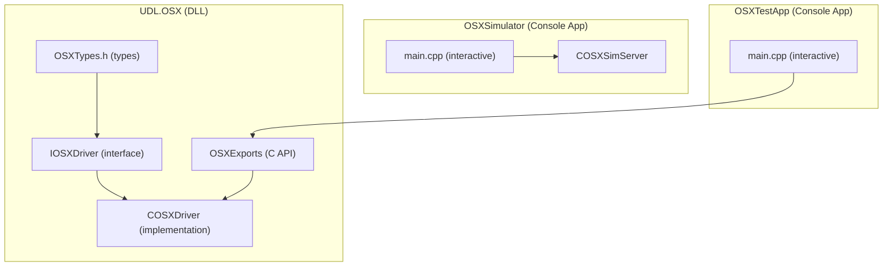

# OSX Optical Switch Driver, Simulator, and Debug Tool

## Device Overview (from documentation)

The OSX-100 is a Santec/JGR Optics optical switch (1xN up to 1x400) with:

- **Communication**: TCP/IP port 5025 (SCPI) or USB (USBTMC)
- **Protocol**: SCPI message-based, commands terminated with `\n`
- **Key difference from RL1**: Commands run **asynchronously** -- must poll `STAT:OPER:COND?` until 0
- **Multi-module**: Can have multiple switch modules in one chassis (e.g., "SX 1Ax24","SX 2Bx12")
- **Configurations**: 1A, 2A, 2B, 2C (single input, dual input, ganged, trailing)
- **Switching time**: 300ms per switch operation

## Architecture Decision

The OSX is a **switch** (not a measurement instrument), so it needs its own interface rather than inheriting from `IEquipmentDriver` (which is measurement-centric with TakeReference/TakeMeasurement/GetResults). We will:

- Create a dedicated `IOSXDriver` interface for switch operations
- Reuse the same TCP networking patterns from `CBaseEquipmentDriver`
- Use a separate namespace `OSXSwitch`
- Follow the same DLL export pattern (C-style API with HANDLE)




## SCPI Command Map (from User Manual Tables 4 & 5)

**Standard SCPI (Table 4)**:

- `*IDN?`, `*RST`, `*CLS`, `*OPC?`, `*WAI`, `*STB?`, `*ESR?`, `*ESE`, `*SRE`
- `:STAT:OPER:COND?` (critical for async polling)
- `:SYST:ERR?`, `:SYST:VERS?`
- `:SYST:COMM:LAN:ADDR?`, `:SYST:COMM:LAN:GATEway?`, `:SYST:COMM:LAN:MASK?`, etc.

**OSX-specific (Table 5)**:

- `CLOSe` / `CLOSe #` / `CLOSe?` -- channel switching
- `CFG:SWT:END?` -- channel count
- `MODule:CATalog?`, `MODule#:INFO?`, `MODule:NUMber?` -- module info
- `MODule:SELect` / `MODule:SELect #` / `MODule:SELect?` -- module selection
- `ROUTe:CHANnel:ALL #` / `ROUTe#:CHANnel #` / `ROUTe#:CLOSe #` / `ROUTe#:CHANnel?` -- routing
- `ROUTe#:COMMon #` / `ROUTe#:COMMon?` -- common input selection
- `ROUTe#:HOMe` -- motor home reset
- `LCL #` / `LCL?` -- local/remote mode
- `TEST:NOTIFY# "<string>"` -- LCD notification

## Project 1: UDL.OSX (DLL)

**Directory**: `TestEquipmentDrivers/UDL.OSX/`

**Files to create**:


| File               | Purpose                                                                           |
| ------------------ | --------------------------------------------------------------------------------- |
| `UDL.OSX.vcxproj`  | VS project (DynamicLibrary, preprocessor `UDLOSX_EXPORTS`)                        |
| `OSXTypes.h`       | Types: `ConnectionConfig`, `DeviceInfo`, `ErrorInfo`, `ModuleInfo`, `SwitchState` |
| `IOSXDriver.h`     | Interface: Connect, Disconnect, SwitchChannel, GetChannel, GetModules, etc.       |
| `COSXDriver.h/cpp` | Full implementation with TCP SCPI and async polling                               |
| `OSXExports.h/cpp` | C-style DLL API (HANDLE-based)                                                    |
| `stdafx.h/cpp`     | Precompiled headers (same pattern as existing)                                    |
| `targetver.h`      | Target version                                                                    |
| `dllmain.cpp`      | DLL entry + WSAStartup                                                            |


**Key interface** (`IOSXDriver`):

```cpp
namespace OSXSwitch {
class IOSXDriver {
public:
    // Connection
    virtual bool Connect() = 0;
    virtual void Disconnect() = 0;
    virtual bool IsConnected() const = 0;
    
    // Device info
    virtual DeviceInfo GetDeviceInfo() = 0;
    virtual ErrorInfo CheckError() = 0;
    virtual std::string GetSystemVersion() = 0;
    
    // Module management
    virtual int GetModuleCount() = 0;
    virtual std::vector<ModuleInfo> GetModuleCatalog() = 0;
    virtual ModuleInfo GetModuleInfo(int moduleIndex) = 0;
    virtual void SelectModule(int moduleIndex) = 0;
    virtual int GetSelectedModule() = 0;
    
    // Channel switching (on selected module)
    virtual void SwitchChannel(int channel) = 0;
    virtual void SwitchNext() = 0;
    virtual int GetCurrentChannel() = 0;
    virtual int GetChannelCount() = 0;
    
    // Multi-module routing
    virtual void RouteChannel(int moduleIndex, int channel) = 0;
    virtual int GetRouteChannel(int moduleIndex) = 0;
    virtual void RouteAllModules(int channel) = 0;
    virtual void SetCommonInput(int moduleIndex, int common) = 0;
    virtual int GetCommonInput(int moduleIndex) = 0;
    virtual void HomeModule(int moduleIndex) = 0;
    
    // Control
    virtual void SetLocalMode(bool local) = 0;
    virtual bool GetLocalMode() = 0;
    virtual void SendNotification(int icon, const std::string& message) = 0;
    
    // Network config
    virtual std::string GetIPAddress() = 0;
    virtual std::string GetGateway() = 0;
    virtual std::string GetNetmask() = 0;
    virtual std::string GetMAC() = 0;
    
    // Operation sync
    virtual bool WaitForOperation(int timeoutMs = 5000) = 0;
    
    // Raw SCPI
    virtual std::string SendRawCommand(const std::string& command) = 0;
};
}
```

**Async operation pattern** -- the critical difference from RL1:

```cpp
bool COSXDriver::WaitForOperation(int timeoutMs) {
    int elapsed = 0;
    while (elapsed < timeoutMs) {
        std::string resp = Query(":STAT:OPER:COND?");
        if (atoi(resp.c_str()) == 0) return true;
        Sleep(10);
        elapsed += 10;
    }
    return false; // timeout
}

void COSXDriver::SwitchChannel(int channel) {
    std::ostringstream cmd;
    cmd << "CLOSe " << channel;
    Write(cmd.str());
    if (!WaitForOperation())
        throw std::runtime_error("Switch operation timed out");
}
```

## Project 2: OSXSimulator (Console App)

**Directory**: `TestEquipmentDrivers/OSXSimulator/`

**Files to create**:


| File                   | Purpose                                     |
| ---------------------- | ------------------------------------------- |
| `OSXSimulator.vcxproj` | VS project (Console Application)            |
| `COSXSimServer.h/cpp`  | TCP server simulating all OSX SCPI commands |
| `main.cpp`             | Entry point with interactive console        |
| `stdafx.h/cpp`         | Precompiled headers                         |
| `targetver.h`          | Target version                              |


**Simulator features**:

- TCP server on port 5025 (configurable)
- Simulates multi-module OSX (configurable module count, type, channel count)
- Async operation simulation: `STAT:OPER:COND?` returns 1 during switch, 0 when done
- Configurable switch delay (default 300ms per spec)
- Supports all Table 4 + Table 5 commands
- Interactive console: toggle verbose, change delay, add/remove modules, show status

**Simulated state**:

- Per-module: configuration type (1A/2A/2B/2C), channel count, current channel, current common
- Global: selected module, local/remote mode, network settings
- Operation status tracking with timing

## Project 3: OSXTestApp (Console App)

**Directory**: `TestEquipmentDrivers/OSXTestApp/`

**Files to create**:


| File                 | Purpose                          |
| -------------------- | -------------------------------- |
| `OSXTestApp.vcxproj` | VS project (Console Application) |
| `main.cpp`           | Interactive debug tool           |
| `stdafx.h/cpp`       | Precompiled headers              |
| `targetver.h`        | Target version                   |


**Test tool features**:

- Interactive menu-driven console
- Connect/Disconnect to OSX (or simulator)
- Query device identity and modules
- Switch channels interactively
- Route commands to specific modules
- Send raw SCPI commands
- Show operation timing
- Links against `UDL.OSX.dll` via C API or direct include

## Solution Integration

Add all 3 new projects to `TestEquipmentDrivers.sln` with new GUIDs and Debug|x64 + Release|x64 configurations, matching the existing pattern.

Update `.gitignore` for the new project output directories.